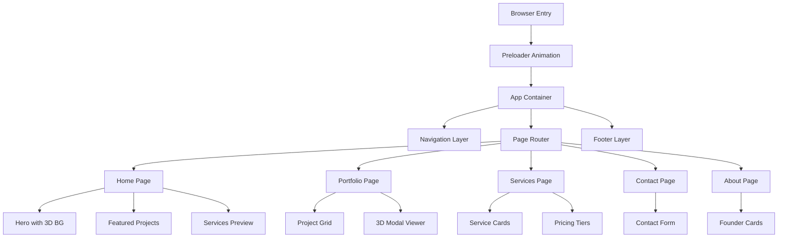

# Design Document: Byte Brothers 3D Professional Portfolio Website

## Overview

Byte Brothers is a premium boutique web engineering studio showcasing cutting-edge digital craftsmanship. This design document outlines the complete technical architecture, interaction patterns, and implementation strategy for a cinematic portfolio website featuring animated 3D elements, smooth parallax scrolling, and high-performance animations.

The site spans five pages (Home, Portfolio, Services, Contact, About) with a cohesive visual language built on a teal/blue gradient color scheme, geometric 3D "B" mark, and premium animation patterns inspired by itsoffbrand.com.

---

## Architecture Overview



---

## Design System

### Color Palette

**Primary Colors:**
- Teal: `#0891b2` (primary accent, brand identity)
- Blue: `#1e40af` (secondary accent, gradients)
- Dark Navy: `#0f172a` (dark mode background)
- White: `#ffffff` (light mode background)

**Semantic Colors:**
- Success: `#10b981` (form validation, confirmations)
- Warning: `#f59e0b` (alerts, cautions)
- Error: `#ef4444` (errors, destructive actions)

**Gradients:**
- Hero Gradient: Teal (#0891b2) → Blue (#1e40af)
- Accent Gradient: Applied to 3D "B" logo, interactive elements

### Typography

**Font Stack:**
- Headlines: Inter / Helvetica (geometric, modern)
- Body: Inter (readable, clean)
- Mono/Code: JetBrains Mono (technical content)

**Scale:**
- H1: 3.5rem / 56px (page titles)
- H2: 2.5rem / 40px (section headers)
- H3: 1.875rem / 30px (subsections)
- Body: 1rem / 16px (primary content)
- Small: 0.875rem / 14px (captions, meta)

### Spacing System

8px base unit:
- xs: 4px
- sm: 8px
- md: 16px
- lg: 24px
- xl: 32px
- 2xl: 48px
- 3xl: 64px

### Responsive Breakpoints

```
- Mobile: 320px - 640px
- Tablet: 641px - 1024px
- Desktop: 1025px - 1440px
- Wide: 1441px+
```

---

## Core Components & Interactions


### Preloader Component

**Purpose:** Animated entrance sequence with brand introduction

**Interaction Flow:**
1. Page load triggers preloader
2. "Byte Brothers" text animates with stroke draw effect (1.2s)
3. Geometric "B" mark scales and rotates (0.8s)
4. Fade to main content (0.4s)
5. Total duration: ~2.4s (skip available after 1.5s)

**Implementation:**
- SVG-based text with stroke animation (Motion/GSAP)
- Canvas-rendered 3D "B" with rotation
- Framer Motion or Motion library for orchestration
- Preload all critical assets during sequence

**Technical Specs:**
```typescript
interface PreloaderConfig {
  duration: 2400; // ms
  skipDelay: 1500; // ms when skip becomes available
  textAnimationDuration: 1200;
  logoRotationDuration: 800;
  fadeOutDuration: 400;
}
```

---

### Navigation Component

**Structure:**
- Fixed top navbar (desktop) / sticky (mobile)
- Logo + text mark (left-aligned)
- Nav links: Home, Portfolio, Services, About, Contact
- Theme toggle + AI Estimator button

**Desktop Behavior:**
- Stays visible on scroll
- Links underline on hover with teal accent
- Active link has persistent underline
- Height: 64px
- Padding: 16px / 24px

**Mobile Behavior:**
- Compact layout at 56px height
- Hamburger menu toggles side drawer
- Drawer slides from left with overlay
- All navigation items in drawer

**3D Effects:**
- Subtle gradient background (0.1 opacity)
- Backdrop blur on scroll (glassmorphism)
- Logo scale on hover (1.05x)

---

### Scroll Progress Bar

**Specification:**
- Fixed top bar indicating page scroll progress
- Height: 3px
- Gradient fill: Teal → Blue (left to right)
- Width % = document scroll %
- Smooth linear animation (no easing)

---

### Footer Component

**Sections:**
1. **Newsletter Signup**
   - Headline + description
   - Email input with validation
   - Submit button (teal gradient)
   - Success/error states

2. **Quick Links**
   - Services
   - Portfolio
   - About
   - Contact

3. **Social Links**
   - GitHub, LinkedIn, Twitter
   - Icon only, teal on hover

4. **Copyright & Legal**
   - Year, studio name
   - Links to Privacy, Terms

**Layout:** 4-column grid (desktop), single column stacked (mobile)


---

## Page Designs

### 1. HOME PAGE

#### Hero Section

**Layout:**
- Full viewport height (100vh)
- Split composition: 60% visual content, 40% text overlay
- Desktop: side-by-side | Mobile: stacked

**Visual Elements:**
- Animated 3D background (WebGL or Canvas-based)
- Geometric shapes responding to cursor movement
- Parallax depth with multiple layers

**Text Overlay:**
- Headline: "Digital Craftsmen" (H1, 3.5rem)
- Subheading: "Engineered experiences that defy convention" (16px, medium weight)
- CTA Button: "View Our Work" (teal gradient, hover scale 1.05x)
- Secondary CTA: "Get Started" (outline variant)

**3D Implementation:**
- WebGL canvas rendering geometric "B" mark
- Cursor tracking: rotation & scale based on mouse position
- Particles or procedural shapes for dynamic background
- Performance target: 60 FPS on desktop, 30+ FPS mobile

**Animation Sequence:**
```
On Page Load:
- Fade in hero content (400ms)
- Stagger headline text (600ms with 50ms between words)
- Slide up CTA buttons (500ms delay)
- 3D background activates immediately
```

**Responsive Behavior:**
- Desktop (1025px+): Full side-by-side
- Tablet (641-1024px): 50/50 split, reduced canvas size
- Mobile (320-640px): Full-width stacked, 50vh hero height

---

#### Featured Projects Carousel

**Specification:**
- 3-4 featured projects on rotation
- Auto-scroll every 5 seconds
- Manual controls: Previous/Next buttons
- Thumbnail indicators below

**Card Layout:**
- Project image (16:9 ratio, rounded corners 8px)
- Project title overlay (bottom-left)
- Tag badges (technology stack)
- Lead indicator (Syed/Hamid)
- Year and status

**Interactions:**
- Hover: Image scales 1.05x, shadow increases
- Thumbnail click: Scroll to that project
- Mobile: Swipe gesture to navigate

**3D Enhancement:**
- Subtle depth via CSS transforms
- Image parallax on scroll (50px offset)

---

#### Services Preview Section

**Grid:** 3-column (desktop) / 2-column (tablet) / 1-column (mobile)

**Service Card Design:**
- Icon (48x48px, teal)
- Title (H3)
- Description (2-3 lines)
- "Learn More" CTA link
- Background gradient on hover (subtle blue tint)

**Cards:**
1. Webflow Enterprise
2. Custom Websites
3. E-Commerce Builds

**Interactive State:**
- Border highlight on hover (teal, 2px)
- Slight lift effect (transform: translateY(-4px))
- Icon rotation on hover (8°)

---

#### Call-to-Action Section

**Layout:**
- Full-width background (navy gradient)
- Centered content, 60% max-width
- Headline + subheading + button

**Copy:**
- Headline: "Ready to elevate your digital presence?"
- Subheading: "Let's discuss your project in detail"
- Button: "Schedule a consultation" (white, blue hover)

**Animation:**
- Entrance: fade-in from bottom (500ms)
- Triggered on scroll into viewport
- Button: Pulse effect (infinite 2s loop)

---

#### Newsletter Signup Section

**Structure:**
- Headline: "Stay updated with our latest work"
- Email input field
- Subscribe button
- Social proof text: "Join 500+ studios"

**Form Validation:**
- Real-time email validation (regex pattern)
- Error state: Red border + error message
- Success state: Checkmark icon, "Thanks for subscribing!"
- Input focus: Teal outline, 2px

**Mobile Adaptation:**
- Full-width input (padding-aware)
- Button stacks below input on narrow screens


---

### 2. PORTFOLIO PAGE

#### Page Header

**Structure:**
- Headline: "Our Work" or "Portfolio" (H1)
- Subheading: "Curated selection of transformative digital projects"
- Filter controls below

**Animation:**
- Entrance: Staggered text reveal (600ms)
- Background: Subtle parallax (20px depth)

---

#### Filter Controls

**Filter Options:**
1. **Technology:** React, Webflow, Node.js, WebGL, TypeScript, etc.
2. **Industry:** Logistics, Education, Corporate, Retail, Engineering
3. **Team Lead:** Syed, Hamid, Both
4. **Status:** Live, In Dev, Case Study

**UI Implementation:**
- Horizontal scroll on mobile
- Horizontal layout on desktop
- Active filter: Teal background, white text
- Inactive: Gray border, dark text
- Multiple selections allowed (AND logic)

**Interaction:**
- Click to toggle filter
- Apply/Reset buttons (optional)
- Results count update (with animation)
- URL params for shareable filtered views

---

#### Project Grid

**Layout:**
- Desktop: 3-column grid (1/3 width per project)
- Tablet: 2-column grid
- Mobile: 1-column (full-width with padding)
- Gap: 24px
- Masonry layout optional (depends on content)

**Project Card:**
```
┌─────────────────────┐
│   [Image]           │  (16:9 ratio, lazy-loaded)
│  [Status Badge]     │  (Live/In Dev/Case Study)
├─────────────────────┤
│ Project Title       │  (H3, 1.5rem)
│ Type • Year         │  (gray, small)
├─────────────────────┤
│ 2 Tags              │  (tech stack, gray bg)
│ Lead: Syed          │  (team member)
│ Tap for details →   │  (hover only)
└─────────────────────┘
```

**Interactions:**
- Hover: Image darkens (0.3 opacity overlay), title color shifts to teal
- Click: Opens Project Modal (fullscreen or slide-over)
- Swipe on mobile: Navigate to next project
- Lazy load images (Intersection Observer)

**3D Enhancement:**
- Card shadow depth increases on hover
- Image parallax on scroll (offset Y by scroll %)

---

#### Project Modal / Detail View

**Structure:**
- Close button (X, top-right)
- Project image (full-width, 50vh height)
- Title + metadata (Year, Lead, Status)
- Description (body text, 2-3 paragraphs)
- Challenge section
- Solution section
- Technology stack (badge list)
- Demo link (if available)
- Related projects carousel at bottom

**3D Model Viewer (if applicable):**
- Embedded Three.js or Babylon.js viewer
- Model controls: Rotate (drag), Zoom (scroll), Pan (right-click)
- Auto-rotate on idle (5s)
- Load indicator while model streams

**Interactions:**
- Backdrop click closes modal
- Escape key closes modal
- Slide gesture (swipe left/right) to navigate between projects
- Smooth transitions (200ms fade)

**Mobile Adaptation:**
- Fullscreen modal (no padding)
- Stacked vertical layout
- Bottom sheet drawer style

---

#### Related Projects Navigation

**Position:** Bottom of modal

**Display:** 2-3 related projects horizontally scrollable

**Logic:**
- Same industry/technology
- Different from current project
- Max 3 suggestions


---

### 3. SERVICES PAGE

#### Services Overview Section

**Layout:**
- Hero headline: "How We Deliver Excellence" (H1)
- Subheading with brief philosophy
- Parallax background with subtle animation

---

#### Service Category Cards

**Grid:** 3-column (desktop) / 2-column (tablet) / 1-column (mobile)

**Card Content:**
```
┌──────────────────────────┐
│ Icon (64x64, teal)       │
│ Service Title (H2)       │
│ Subtitle (uppercase, sm) │
├──────────────────────────┤
│ Description (body text)  │
│                          │
│ Est. Time: 4-8 Weeks    │
├──────────────────────────┤
│ Features (bullet list)   │
│ • Feature 1              │
│ • Feature 2              │
│ • Feature 3              │
│ • Feature 4              │
└──────────────────────────┘
```

**Services:**
1. Webflow Enterprise & Hybrid Systems
2. Custom Business Websites
3. Portfolio Sites
4. E-Commerce Builds
5. Maintenance & Retainers

**Interactions:**
- Hover: Border becomes teal (2px)
- Shadow lift (transform: translateY(-8px))
- Icon animates (scale 1.1x, rotate 5°)
- "Learn More" link appears/slides up

**3D Effects:**
- Card has subtle depth (box-shadow with 3D perspective)
- Background gradient shifts on hover

---

#### Technology Proficiency Matrix

**Layout:** 2-column (desktop) or stacked (mobile)

**Left Column - Technologies:**
List of tech stack with proficiency indicators:
- React: ██████████ (100%)
- TypeScript: ██████████ (100%)
- Webflow: ███████████ (90%)
- Node.js: ██████████ (100%)
- WebGL: ████████░░ (70%)
- Next.js: ██████████ (95%)

**Right Column - Specializations:**
Text content describing technical depth in each area

**Visual:**
- Progress bars with teal fill
- Smooth animation on page enter (1s)
- Staggered reveal (100ms between items)

---

#### Service Comparison Section

**Structure:** Comparison table or card grid

**Comparison Dimensions:**
- Service Type
- Delivery Time
- Complexity Level
- Ideal For
- Starting Price (optional)
- Support Tier

**Table (Desktop):** Full comparison matrix
**Cards (Mobile):** Vertical stacked comparison

---

#### Project Examples Section

**Display:** 2-3 example projects per service

**Layout:** 3-column grid (desktop) / carousel (mobile)

**Card:** Similar to portfolio grid cards

**CTA:** "See full case study" link for each

---

#### Pricing Tiers Section

**Grid:** 3-column (desktop) / 1-column (mobile)

**Tier Cards:**
```
┌─────────────────────┐
│ Service Name        │
│ Starting at $X,XXX  │
├─────────────────────┤
│ • Feature 1         │
│ • Feature 2         │
│ • Feature 3         │
├─────────────────────┤
│ [Get Estimate]      │
└─────────────────────┘
```

**Highlight Logic:**
- Most popular tier has border color teal (2px)
- Slight scale increase (1.02x)

**Interactive:**
- Hover: Shadow expands, slight lift
- CTA click: Scroll to contact form with service pre-filled

---

#### CTA Section

**Content:**
- Headline: "Let's discuss your project"
- 2 CTAs:
  - "Schedule consultation" (primary)
  - "Get AI estimate" (secondary)


---

### 4. CONTACT PAGE

#### Page Header

**Headline:** "Let's Talk"
**Subheading:** "Got a project in mind? Let's bring it to life together."

---

#### Main Contact Form

**Layout:** 2-column (desktop) / single column (mobile)

**Left Column - Form Fields:**

1. **Name**
   - Text input
   - Placeholder: "Your name"
   - Required validation

2. **Email**
   - Email input
   - Placeholder: "you@company.com"
   - Real-time validation
   - Error: "Please enter valid email"

3. **Company**
   - Text input
   - Placeholder: "Your company"
   - Optional

4. **Project Type**
   - Dropdown/Select
   - Options: Webflow, React Site, E-commerce, Custom, Other
   - Required

5. **Budget Range**
   - Select dropdown
   - Options: <$5k, $5-15k, $15-30k, $30k+, Not sure
   - Optional

6. **Timeline**
   - Radio buttons
   - Options: ASAP, 1-3 months, 3-6 months, Not decided
   - Required

7. **Project Description**
   - Textarea (5 rows)
   - Placeholder: "Tell us about your project..."
   - Min 20 characters, Max 2000
   - Character count indicator
   - Required

8. **File Upload**
   - Dropzone area
   - Accepts: PDF, PNG, JPG, Figma link, Webflow link
   - Max 10MB per file, 3 files max
   - Shows file previews
   - Optional

9. **Attached Spec** (if pre-filled)
   - Gray box displaying attached information
   - Editable inline
   - Removable with X button

**Right Column - Contact Info / Additional Info:**

- Headline: "Other ways to reach us"
- Email link (clickable)
- Phone link (clickable)
- Office address
- Social links (GitHub, LinkedIn)
- Map embed (optional)

---

#### Form Interactions

**Text Inputs:**
- Focus: Teal border (2px), background lightens
- Blur: Validation runs
- Error: Red border + error message below
- Success: Green checkmark (subtle)

**Textarea:**
- Dynamic height (grows as content added)
- Word/character counter (bottom-right)
- Char limit: 2000 (red text when exceeded)

**File Upload:**
- Dropzone has dashed teal border
- Hover: Background highlight (teal 0.05 opacity)
- Files display as chips (with delete X)
- Error states for invalid files

**Form Buttons:**
```
[Cancel]  [Submit]
 (outline) (teal gradient, hover glow)
```

**Submission:**
- Loading state: Spinner + "Submitting..."
- Success: Modal/toast "Message received! We'll get back within 24h"
- Error: Toast "Something went wrong. Please try again"
- Network error: Toast with retry button

---

#### Alternative Contact Methods

**Section Title:** "Prefer something else?"

**Options Grid:**
1. **Email**
   - Direct email link
   - Copy-to-clipboard button

2. **Schedule a Call**
   - Calendly embed or link

3. **Slack Channel**
   - Workspace link (if applicable)

4. **Office Visit**
   - Address + map embed

---

#### Success State

**After Submission:**
- Form fields cleared (or disabled)
- Success banner: "Thanks! We'll review your message and contact you soon."
- Auto-hide after 5s or show close button
- Suggest next actions:
  - "Book a consultation"
  - "Check out our portfolio"
  - "Back to home"

---

#### Mobile Optimizations

- Single column layout
- Full-width inputs
- Larger touch targets (44px min)
- Sticky submit button at bottom
- Collapse secondary info under collapsible section


---

### 5. ABOUT PAGE

#### Hero Section

**Headline:** "About Byte Brothers"
**Subheading:** "A small studio of big thinkers pushing the boundaries of digital craft"

---

#### Studio Story Section

**Layout:** 2-column (desktop) / stacked (mobile)

**Left Column - Text:**
- Narrative about founding story
- Company mission statement
- Philosophy on design & engineering
- 2-3 paragraphs, body text

**Right Column - Visual:**
- Large image or 3D visualization
- Parallax effect on scroll (20px offset)

---

#### Founder Profiles Section

**Layout:** Side-by-side cards (desktop) / stacked (mobile)

**Founder Card Design:**
```
┌─────────────────────────┐
│    [Avatar Image]       │  (280x280px circle)
│                         │
├─────────────────────────┤
│ Name                    │
│ ROLE / TITLE (caps)     │
├─────────────────────────┤
│ "Subtitle / Tagline"    │  (italic, smaller)
│                         │
│ Bio paragraph...        │
│ Bio paragraph...        │
│                         │
│ Highlights:             │
│ • Skill 1               │
│ • Skill 2               │
│ • Skill 3               │
├─────────────────────────┤
│ Specialties:            │
│ [Badge 1] [Badge 2]     │
│ [Badge 3] [Badge 4]     │
├─────────────────────────┤
│ [GitHub] [LinkedIn]     │  (icon links)
└─────────────────────────┘
```

**Interactions:**
- Hover: Card border becomes teal (2px)
- Avatar scales 1.05x
- Social links animate underline on hover
- Background subtle gradient shift

---

#### Technical Tenets Section

**Layout:** 2x2 grid (desktop) / stacked (mobile)

**Tenet Card:**
```
┌──────────────────────┐
│ 01 (large number)    │
│ CATEGORY (uppercase) │
├──────────────────────┤
│ Title                │
│ (H3, teal)           │
│                      │
│ Description text...  │
│ Body text, 2 lines   │
└──────────────────────┘
```

**Tenets:**
1. Zero-Bloat Philosophy (Performance)
2. Pixel-Perfect (Craft)
3. Legacy Code (Future)
4. Architectural Rigor (Structure)

**Styling:**
- Alternate background colors (light gray/white)
- Numbers have teal color
- Hover: Slight lift (transform: translateY(-4px))
- Icon (optional) in top-right

---

#### Timeline / Achievements Section

**Title:** "Our Journey"

**Layout:** Vertical timeline (desktop) / horizontal scroll (mobile)

**Timeline Item:**
```
Year • Event Title
Brief description of achievement or milestone
```

**Interactive:**
- Hover: Highlight teal color
- Vertical line connecting items
- Alternating left/right layout (desktop)

**Sample Milestones:**
- 2022: Studio founded
- 2023: First 10 enterprise clients
- 2024: 50+ successful projects

---

#### Testimonials Section

**Title:** "What Our Clients Say"

**Layout:** Carousel (3 visible desktop) / single (mobile)

**Testimonial Card:**
```
┌────────────────────────────┐
│ ★★★★★ (5 stars)           │
│                            │
│ "Quote from client about   │
│  the work and experience"  │
│                            │
│ — Client Name              │
│   Company Title            │
│   [Company Logo]           │
└────────────────────────────┘
```

**Interactions:**
- Auto-scroll every 6s
- Manual controls: Previous/Next buttons
- Dot indicators (clickable)
- Swipe on mobile

---

#### Call-to-Action Section

**Content:**
- Headline: "Ready to work together?"
- Description: "Let's build something extraordinary"
- Buttons:
  - "Start a project" (primary)
  - "View our portfolio" (secondary)

**Parallax background with subtle animation**


---

## Animation & Motion System

### Entrance Animations

**Page Load Sequence:**
1. Preloader (2.4s total)
2. Hero content fade-in (400ms) with stagger
3. Page-specific content reveals (500-800ms)

**Pattern - Staggered Text Reveal:**
```
Word 1: opacity 0 → 1 (150ms at 0ms)
Word 2: opacity 0 → 1 (150ms at 50ms)
Word 3: opacity 0 → 1 (150ms at 100ms)
```

**Pattern - Slide-Up Entrance:**
```
Element starts: transform: translateY(20px), opacity 0
Target: transform: translateY(0), opacity 1
Duration: 500ms
Easing: easeOut (cubic-bezier(0.22, 1, 0.36, 1))
```

---

### Scroll Trigger Animations

**Global Pattern:**
- Trigger when element enters viewport (bottom 30%)
- Animations fire once (reset on page reload only)

**Hero Parallax:**
- Background moves slower than foreground
- Offset: background Y = scrollY * 0.5
- Creates depth illusion

**Element Scale on Scroll:**
- Cards scale from 0.9 to 1.0 as scroll approaches
- Opacity: 0 to 1 simultaneously
- Duration: while element is in viewport

**Text Highlight Animation:**
- Underline reveals from left-to-right
- Color: teal gradient
- Duration: 800ms
- Stagger: 100ms per word

---

### Hover & Interaction Animations

**Button Hover States:**
```
Normal:
  - Background: teal gradient
  - Shadow: 0 4px 12px rgba(8, 145, 178, 0.2)

Hover:
  - Background: teal gradient (lightened +10%)
  - Shadow: 0 8px 24px rgba(8, 145, 178, 0.4)
  - Transform: scale(1.02)
  - Transition: all 200ms ease-out
```

**Link Hover:**
```
Underline: scaleX(0) → scaleX(1)
Duration: 300ms
Origin: left
Color: teal
```

**Card Hover (Portfolio Grid):**
```
Simultaneous:
  - Shadow depth increases
  - Image overlay appears (0.2 black opacity)
  - Border color shifts to teal
  - Slight lift: translateY(-4px)
Duration: 300ms ease-out
```

**3D Logo Hover (Navbar):**
```
- Scale: 1.0 → 1.05
- Rotation: slight (2-3 degrees)
- Duration: 300ms
```

---

### Scroll Velocity Effects

**Fast Scroll:** Elements transition faster (1x speed)
**Slow Scroll:** Elements transition smoothly (0.5x speed)

Implemented via Framer Motion's `useScroll` and `useTransform`

---

### Micro-interactions

**Form Input Focus:**
- Border color: gray → teal
- Shadow: 0 0 0 3px rgba(8, 145, 178, 0.1)
- Transition: 200ms

**Form Input Valid:**
- Green checkmark appears (fade-in 200ms)
- Position: right side of input

**File Upload Drag-Over:**
- Background: teal 0.1 opacity
- Border: 2px dashed teal
- Scale: 1.02
- Duration: 200ms

**Toast Notification:**
- Slide up from bottom: translateY(0) from translateY(100px)
- Fade in: opacity 0 → 1
- Duration: 300ms
- Auto-dismiss after 4s (fade-out 300ms)

---

### Loading States

**Button Loading:**
- Text fades to 50% opacity
- Spinner icon appears (4px dots rotating)
- Duration: while loading

**Page Transition:**
- Fade out (100ms)
- Route change
- Fade in (200ms)
- Scroll to top smoothly

**Skeleton Screens:**
- Gray placeholder blocks
- Shimmer animation (left-to-right gradient pulse)
- Duration: 1.5s loop

---

### 3D Animation Specifications

**WebGL Hero Background:**
- 60 FPS target (desktop)
- Geometries: Rotating cube, octahedron, or custom "B" mark
- Colors: Teal-blue gradient applied to geometries
- Lighting: 2-3 point lights with soft shadows
- Particle system: 50-100 particles drifting (slow, no interaction)
- Cursor tracking: Rotation offset ±10 degrees

**Implementation:**
- Three.js or Babylon.js
- Use `useThree` hook for camera control
- Optimize with `useFrame` for animation loop
- Lazy load WebGL on viewport entry

**Fallback (WebGL unsupported):**
- CSS gradient background
- SVG animations instead
- Still maintains animation quality


---

## 3D Integration Strategy

### Asset Pipeline

**3D Model Format:** glTF 2.0 (.glb)
- Rationale: Web standard, compressed, wide tool support
- Size optimization: Draco compression (80% reduction)
- Typical file size: 200KB - 2MB per model

**Texture Optimization:**
- WebP format (primary), PNG fallback
- Size: 2K (2048x2048) for hero elements
- 1K for secondary elements
- Compression: JPEG-XL or WebP with 75% quality

**Model Hosting:**
- CDN delivery (Cloudflare, Vercel, AWS CloudFront)
- HTTP/2 Server Push for critical assets
- Lazy loading off-viewport models

---

### 3D Viewers

**Project Modal 3D Viewer:**
- Framework: Three.js Canvas
- Features:
  - Orbit controls (mouse drag to rotate)
  - Zoom with mouse wheel
  - Pan with right-click + drag
  - Auto-rotate on idle (5s of inactivity)
  - Reset button (keyboard: R)

**Implementation Component:**
```typescript
interface ModelViewer {
  modelUrl: string;
  autoRotate: boolean;
  scale: 1.0;
  cameraPosition: [number, number, number];
}
```

---

### Hero 3D Background

**Composition:**
- Multiple layers with parallax
- Layer 1: Animated geometric shapes (closest to camera)
- Layer 2: Particle system (middle distance)
- Layer 3: Static background (farthest)

**Performance Optimization:**
- Frustum culling (don't render off-screen objects)
- LOD (Level of Detail) for complex models
- Texture atlasing for batch rendering
- Instanced rendering for repeated geometries

**Mobile Optimization:**
- Reduced particle count (50 vs 200 on desktop)
- Lower polygon count for geometries
- Simplified lighting (1 light instead of 3)
- 30 FPS target (acceptable for mobile)

---

### Fallback & Progressive Enhancement

**Device Capability Detection:**
```typescript
const canRender3D = (() => {
  const canvas = document.createElement('canvas');
  return !!(canvas.getContext('webgl') || 
            canvas.getContext('webgl2'));
})();
```

**Fallback Strategy:**
1. Check WebGL support
2. If yes: Load and render 3D
3. If no: Use CSS gradient + SVG animations
4. Monitor: If frame rate drops below 20 FPS, switch to fallback

**Network Detection:**
- Slow 3G or offline: Use fallback immediately
- Fast 4G/5G: Load 3D with defer
- Medium connection: Load simplified 3D


---

## Performance Optimization Strategy

### Lighthouse Targets

- **Performance:** 95+ (Target: <2.5s FCP, <3.8s LCP)
- **Accessibility:** 95+
- **Best Practices:** 95+
- **SEO:** 95+

### Code Splitting

**Route-Based:**
- Home: ~/50KB
- Portfolio: ~/45KB
- Services: ~/40KB
- Contact: ~/35KB
- About: ~/38KB
- Shared: ~/30KB (components, hooks)

**Component Lazy Loading:**
```typescript
const ProjectModal = lazy(() => import('./ProjectModal'));
const AiEstimator = lazy(() => import('./AiEstimator'));
```

### Image Optimization

**Sizes & Formats:**
- Hero: 1400x800px (WebP 180KB, PNG fallback 350KB)
- Project cards: 800x600px (WebP 120KB)
- Founder avatars: 300x300px (WebP 45KB)
- Icons: SVG format (2-5KB)

**Responsive Images:**
```html
<picture>
  <source srcset="image.webp" type="image/webp">
  <source srcset="image.jpg" type="image/jpeg">
  
</picture>
```

**Lazy Loading:**
- Intersection Observer API
- Images load 100px before viewport entry
- Blur-up placeholder (base64 10x8px encoded)

### Bundle Analysis

**Target:** < 150KB gzip (initial JS + CSS)

**Break-down:**
- React + React-DOM: 40KB
- Motion/Framer libraries: 30KB
- Tailwind CSS: 25KB
- Custom code: 35KB
- Utilities & vendor: 20KB

### Network Optimization

**HTTP/2 Server Push:**
Push critical assets:
- index.html
- main.css
- main.js
- Google Fonts

**Resource Hints:**
```html
<link rel="dns-prefetch" href="https://cdn.example.com">
<link rel="preconnect" href="https://fonts.googleapis.com">
<link rel="prefetch" href="/portfolio.js">
<link rel="preload" href="/hero-image.webp" as="image">
```

**Caching Strategy:**
- Static assets: Cache-Control: max-age=31536000 (1 year)
- HTML: Cache-Control: max-age=3600 (1 hour)
- API responses: Cache-Control: max-age=300 (5 minutes)

### 3D Asset Performance

**Hero 3D:**
- Draco compression: 80% file size reduction
- Instanced rendering for particles
- GPU-accelerated shaders
- Optimization: Remove unused materials/textures

**Model Viewer 3D:**
- Progressive loading (simplified geometry first, detailed later)
- Texture streaming
- Maximum 2MB per model

### Runtime Optimization

**React Optimization:**
- Memoization for expensive components
- useCallback for event handlers
- Code splitting with Suspense
- Virtual scrolling for large lists

**CSS Optimization:**
- Tailwind JIT (Just-In-Time compilation)
- Remove unused CSS via PurgeCSS
- Minify final CSS output

**JavaScript Optimization:**
- Tree-shaking unused exports
- Remove console.log in production
- Minify and compress with gzip

### Monitoring & Observability

**Performance Metrics:**
- Largest Contentful Paint (LCP)
- First Input Delay (FID)
- Cumulative Layout Shift (CLS)
- Time to Interactive (TTI)

**Tools:**
- Lighthouse CI (automated testing)
- Web Vitals library (real user monitoring)
- Sentry (error tracking)
- Analytics dashboard (custom metrics)


---

## Accessibility (WCAG 2.1 AA)

### Color Contrast

**Minimum:** 4.5:1 for normal text, 3:1 for large text

**Verified Combinations:**
- Teal (#0891b2) on white: 6.8:1 ✓
- Dark Navy (#0f172a) on white: 18.9:1 ✓
- Blue (#1e40af) on white: 7.2:1 ✓

### Keyboard Navigation

**Tab Order:**
- Navbar (logo, links, theme toggle, estimator)
- Main content (visible on current page)
- Footer (links, newsletter, socials)

**Focus Indicators:**
- Focus ring: 2px solid teal
- Offset: 2px
- High contrast against background

**Keyboard Shortcuts:**
- Tab: Next focusable element
- Shift+Tab: Previous focusable element
- Enter: Activate button/link
- Escape: Close modals
- Arrow keys: Navigate carousels (when focused)

### Screen Reader Support

**Semantic HTML:**
```html
<nav>, <main>, <section>, <article>, <aside>, <footer>
```

**ARIA Labels:**
```html
<button aria-label="Close modal">×</button>
<div aria-live="polite">Form validation message</div>

```

**Skip Links:**
```html
<a href="#main-content" className="sr-only">Skip to main content</a>
```

### Form Accessibility

**Labels:**
- Every input has associated `<label>` with for attribute
- Labels visible (not hidden)

**Error Messages:**
- Associated with input via `aria-describedby`
- Color + icon (not color alone)
- Announced to screen readers

**Required Fields:**
- `required` attribute on HTML element
- Visual indicator: asterisk (*)
- `aria-required="true"` for dynamic fields

### Motion & Animation

**Respect prefers-reduced-motion:**
```css
@media (prefers-reduced-motion: reduce) {
  * {
    animation-duration: 0.01ms !important;
    animation-iteration-count: 1 !important;
    transition-duration: 0.01ms !important;
  }
}
```

### Image & Media

**Images:**
- Descriptive alt text (not "image of...")
- Decorative images: empty alt ("")

**Videos:**
- Captions (CC button visible)
- Transcript provided

### Color Blindness

**Design considerations:**
- Don't rely on color alone (use icons + color)
- Use sufficient contrast
- Test with color-blind simulators


---

## Dark Mode Implementation

### Color Mappings

**Text:**
- Primary (Light Mode): #0f172a → Primary (Dark Mode): #ffffff
- Secondary (Light Mode): #64748b → Secondary (Dark Mode): #cbd5e1

**Backgrounds:**
- Background (Light Mode): #ffffff → Background (Dark Mode): #0f172a
- Surface (Light Mode): #f1f5f9 → Surface (Dark Mode): #1e293b

**Accent Colors:**
- Unchanged: Teal (#0891b2) and Blue (#1e40af) maintain same values

### Toggle Implementation

**Location:** Navbar, top-right

**Indicator:**
- Sun icon (light mode)
- Moon icon (dark mode)
- Smooth rotation transition (180°, 300ms)

**Storage:**
- localStorage key: "theme-preference"
- Values: "light" | "dark" | "system"
- System preference detection: `prefers-color-scheme` media query

**CSS Variables:**
```css
:root {
  --bg-primary: #ffffff;
  --text-primary: #0f172a;
}

:root.dark {
  --bg-primary: #0f172a;
  --text-primary: #ffffff;
}
```

**Transition:**
```css
* {
  transition: background-color 200ms, color 200ms, border-color 200ms;
}
```

### Component Adaptations

**Images:**
- Some images may have invert filters in dark mode
- Alternative images (if design differs significantly)

**Charts/Graphs:**
- Axes text: white/light in dark mode
- Grid lines: reduced opacity

**Buttons:**
- Dark mode: slightly different gradient or opacity
- Maintain sufficient contrast


---

## Responsive Design Specifications

### Breakpoints

```
Mobile-First Approach:

Base: 320px - 640px
  - Single column layouts
  - Full-width components (with padding 16px)
  - Touch-friendly targets (44px minimum)

Tablet: 641px - 1024px
  - 2-column grids where applicable
  - Adjusted spacing (padding 24px)
  - Slightly larger text (18px base)

Desktop: 1025px - 1440px
  - 3-column grids
  - Full sidebar layouts
  - Optimal line length (60-80 characters)

Wide: 1441px+
  - Max-width constraints (1400px)
  - Centered layouts
  - Horizontal spacing optimization
```

### Mobile-Specific Adaptations

**Navigation:**
- Hamburger menu (3-line icon)
- Full-screen drawer on toggle
- Overlay backdrop

**Hero Section:**
- 60vh height (not 100vh)
- Stacked layout
- Smaller font sizes (H1: 2rem instead of 3.5rem)

**Grid Layouts:**
- 2-column → 1-column
- 3-column → 2-column → 1-column

**Typography:**
- H1: 1.875rem (mobile) → 3.5rem (desktop)
- Body: 0.95rem (mobile) → 1rem (desktop)
- Small: 0.8rem (mobile) → 0.875rem (desktop)

**Touch Interactions:**
- Hover states unavailable (use active/focus instead)
- Larger tap targets (48px minimum for buttons)
- Swipe gestures for carousels
- Bottom sheet drawers instead of side modals

**Forms:**
- Full-width inputs
- Larger labels (14px)
- Smaller number inputs (avoid zoom on input focus)
- Floating labels on focus

### Tablet-Specific Adaptations

**Grid Layouts:**
- 2-column for project grid
- 2-column for services

**Navigation:**
- Standard navbar (no drawer if space allows)
- Horizontal menu items

**Modals:**
- Slide-over drawer (from right, 70% width)
- Or fullscreen with header

---

## State Management & Data Flow

### Global State

**Using Context API + useState:**
- Current theme (light/dark)
- Current page (activeTab)
- Selected project (for modal)
- Form drafts (localStorage backup)

**Redux Alternative (if needed):**
- Better for complex state
- Devtools integration
- Middleware for logging

### Component Props

**Page Components:**
```typescript
interface PageProps {
  setActiveTab: (tab: string) => void;
  onSelectProject?: (project: Project) => void;
  onOpenAiEstimator?: () => void;
  onOpenContactModal?: () => void;
}
```

**Shared Components:**
```typescript
interface ModalProps {
  isOpen: boolean;
  onClose: () => void;
  data?: any;
}
```

### Side Effects

**On Mount:**
- Register service worker (offline caching)
- Initialize theme preference
- Set up analytics

**On Scroll:**
- Trigger entrance animations
- Update scroll progress bar
- Parallax calculations

**On Route Change:**
- Clear modals
- Reset form state
- Scroll to top


---

## Browser & Device Compatibility

### Browser Support

**Modern Browsers (Full Support):**
- Chrome 90+
- Firefox 88+
- Safari 14+
- Edge 90+

**Graceful Degradation:**
- IE 11: Basic functionality, no animations/3D
- Older mobile browsers: Core content only

### Device Support

**Desktop:**
- MacOS (Safari, Chrome)
- Windows (Chrome, Edge, Firefox)
- Linux (Chrome, Firefox)

**Mobile:**
- iOS 12+ (Safari, Chrome)
- Android 8+ (Chrome, Firefox, Samsung Internet)

**Tablet:**
- iPad OS 12+
- Android 8+

### Feature Detection

**JavaScript Feature Checks:**
```typescript
// WebGL support
const supportsWebGL = !!window.WebGLRenderingContext;

// Intersection Observer
const supportsIO = 'IntersectionObserver' in window;

// Local Storage
const supportsLS = typeof Storage !== 'undefined';

// Service Worker
const supportsSW = 'serviceWorker' in navigator;
```

---

## SEO & Meta Tags

### Page Metadata

**Home Page:**
- Title: "Byte Brothers – Premium Web Engineering & Design Studio"
- Description: "Award-winning digital studio specializing in Webflow, React, and 3D web experiences. Portfolio of high-performing websites and interactive projects."
- OG Image: Hero section screenshot (1200x630px)

**Portfolio Page:**
- Title: "Portfolio – Byte Brothers | Featured Projects"
- Description: "Explore our curated collection of transformative digital projects, case studies, and technical showcases."

**Services Page:**
- Title: "Services – Byte Brothers | Webflow & Custom Development"
- Description: "Elite Webflow design, custom React builds, e-commerce development, and digital strategy services for growth-focused brands."

**Contact Page:**
- Title: "Contact Us – Byte Brothers | Let's Build Together"
- Description: "Get in touch with Byte Brothers. Schedule a consultation, request an estimate, or inquire about our services."

**About Page:**
- Title: "About Byte Brothers – Our Story & Team"
- Description: "Meet Syed and Hamid, founders of Byte Brothers. Learn about our mission, technical philosophy, and approach to digital craftsmanship."

### Structured Data

**Schema.org Implementation:**
```json
{
  "@context": "https://schema.org",
  "@type": "Organization",
  "name": "Byte Brothers",
  "url": "https://bytebrothers.studio",
  "logo": "https://bytebrothers.studio/logo.png",
  "description": "Premium web engineering studio",
  "sameAs": [
    "https://github.com/bytebrothers",
    "https://linkedin.com/company/byte-brothers"
  ],
  "address": {
    "@type": "PostalAddress",
    "addressLocality": "City",
    "addressRegion": "State",
    "postalCode": "12345",
    "addressCountry": "US"
  }
}
```

### Sitemap & Robots

**sitemap.xml:**
```xml
<?xml version="1.0" encoding="UTF-8"?>
<urlset xmlns="http://www.sitemaps.org/schemas/sitemap/0.9">
  <url>
    <loc>https://bytebrothers.studio/</loc>
    <priority>1.0</priority>
  </url>
  <url>
    <loc>https://bytebrothers.studio/portfolio</loc>
    <priority>0.9</priority>
  </url>
  <!-- ... additional URLs ... -->
</urlset>
```

**robots.txt:**
```
User-agent: *
Allow: /
Disallow: /admin
Sitemap: https://bytebrothers.studio/sitemap.xml
```

### Open Graph & Twitter Cards

```html
<!-- OG Tags -->
<meta property="og:title" content="Page Title">
<meta property="og:description" content="Page description">
<meta property="og:image" content="https://bytebrothers.studio/og-image.png">
<meta property="og:url" content="https://bytebrothers.studio">
<meta property="og:type" content="website">

<!-- Twitter Card -->
<meta name="twitter:card" content="summary_large_image">
<meta name="twitter:title" content="Page Title">
<meta name="twitter:description" content="Page description">
<meta name="twitter:image" content="https://bytebrothers.studio/og-image.png">
```

