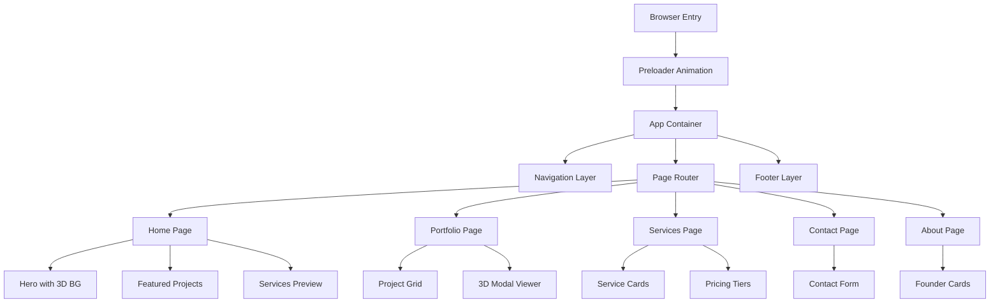

# Design Document: Byte Brothers 3D Professional Portfolio Website

## Overview

Byte Brothers is a premium boutique web engineering studio showcasing cutting-edge digital craftsmanship. This design document outlines the complete technical architecture, interaction patterns, and implementation strategy for a cinematic portfolio website featuring animated 3D elements, smooth parallax scrolling, and high-performance animations.

The site spans five pages (Home, Portfolio, Services, Contact, About) with a cohesive visual language built on a teal/blue gradient color scheme, geometric 3D "B" mark, and premium animation patterns inspired by itsoffbrand.com.

---

## Architecture Overview



---

## Design System

### Color Palette

**Primary Colors:**
- Teal: `#0891b2` (primary accent, brand identity)
- Blue: `#1e40af` (secondary accent, gradients)
- Dark Navy: `#0f172a` (dark mode background)
- White: `#ffffff` (light mode background)

**Semantic Colors:**
- Success: `#10b981` (form validation, confirmations)
- Warning: `#f59e0b` (alerts, cautions)
- Error: `#ef4444` (errors, destructive actions)

**Gradients:**
- Hero Gradient: Teal (#0891b2) → Blue (#1e40af)
- Accent Gradient: Applied to 3D "B" logo, interactive elements

### Typography

**Font Stack:**
- Headlines: Inter / Helvetica (geometric, modern)
- Body: Inter (readable, clean)
- Mono/Code: JetBrains Mono (technical content)

**Scale:**
- H1: 3.5rem / 56px (page titles)
- H2: 2.5rem / 40px (section headers)
- H3: 1.875rem / 30px (subsections)
- Body: 1rem / 16px (primary content)
- Small: 0.875rem / 14px (captions, meta)

### Spacing System

8px base unit:
- xs: 4px
- sm: 8px
- md: 16px
- lg: 24px
- xl: 32px
- 2xl: 48px
- 3xl: 64px

### Responsive Breakpoints

```
- Mobile: 320px - 640px
- Tablet: 641px - 1024px
- Desktop: 1025px - 1440px
- Wide: 1441px+
```

---

## Core Components & Interactions


### Preloader Component

**Purpose:** Animated entrance sequence with brand introduction

**Interaction Flow:**
1. Page load triggers preloader
2. "Byte Brothers" text animates with stroke draw effect (1.2s)
3. Geometric "B" mark scales and rotates (0.8s)
4. Fade to main content (0.4s)
5. Total duration: ~2.4s (skip available after 1.5s)

**Implementation:**
- SVG-based text with stroke animation (Motion/GSAP)
- Canvas-rendered 3D "B" with rotation
- Framer Motion or Motion library for orchestration
- Preload all critical assets during sequence

**Technical Specs:**
```typescript
interface PreloaderConfig {
  duration: 2400; // ms
  skipDelay: 1500; // ms when skip becomes available
  textAnimationDuration: 1200;
  logoRotationDuration: 800;
  fadeOutDuration: 400;
}
```

---

### Navigation Component

**Structure:**
- Fixed top navbar (desktop) / sticky (mobile)
- Logo + text mark (left-aligned)
- Nav links: Home, Portfolio, Services, About, Contact
- Theme toggle + AI Estimator button

**Desktop Behavior:**
- Stays visible on scroll
- Links underline on hover with teal accent
- Active link has persistent underline
- Height: 64px
- Padding: 16px / 24px

**Mobile Behavior:**
- Compact layout at 56px height
- Hamburger menu toggles side drawer
- Drawer slides from left with overlay
- All navigation items in drawer

**3D Effects:**
- Subtle gradient background (0.1 opacity)
- Backdrop blur on scroll (glassmorphism)
- Logo scale on hover (1.05x)

---

### Scroll Progress Bar

**Specification:**
- Fixed top bar indicating page scroll progress
- Height: 3px
- Gradient fill: Teal → Blue (left to right)
- Width % = document scroll %
- Smooth linear animation (no easing)

---

### Footer Component

**Sections:**
1. **Newsletter Signup**
   - Headline + description
   - Email input with validation
   - Submit button (teal gradient)
   - Success/error states

2. **Quick Links**
   - Services
   - Portfolio
   - About
   - Contact

3. **Social Links**
   - GitHub, LinkedIn, Twitter
   - Icon only, teal on hover

4. **Copyright & Legal**
   - Year, studio name
   - Links to Privacy, Terms

**Layout:** 4-column grid (desktop), single column stacked (mobile)


---

## Page Designs

### 1. HOME PAGE

#### Hero Section

**Layout:**
- Full viewport height (100vh)
- Split composition: 60% visual content, 40% text overlay
- Desktop: side-by-side | Mobile: stacked

**Visual Elements:**
- Animated 3D background (WebGL or Canvas-based)
- Geometric shapes responding to cursor movement
- Parallax depth with multiple layers

**Text Overlay:**
- Headline: "Digital Craftsmen" (H1, 3.5rem)
- Subheading: "Engineered experiences that defy convention" (16px, medium weight)
- CTA Button: "View Our Work" (teal gradient, hover scale 1.05x)
- Secondary CTA: "Get Started" (outline variant)

**3D Implementation:**
- WebGL canvas rendering geometric "B" mark
- Cursor tracking: rotation & scale based on mouse position
- Particles or procedural shapes for dynamic background
- Performance target: 60 FPS on desktop, 30+ FPS mobile

**Animation Sequence:**
```
On Page Load:
- Fade in hero content (400ms)
- Stagger headline text (600ms with 50ms between words)
- Slide up CTA buttons (500ms delay)
- 3D background activates immediately
```

**Responsive Behavior:**
- Desktop (1025px+): Full side-by-side
- Tablet (641-1024px): 50/50 split, reduced canvas size
- Mobile (320-640px): Full-width stacked, 50vh hero height

---

#### Featured Projects Carousel

**Specification:**
- 3-4 featured projects on rotation
- Auto-scroll every 5 seconds
- Manual controls: Previous/Next buttons
- Thumbnail indicators below

**Card Layout:**
- Project image (16:9 ratio, rounded corners 8px)
- Project title overlay (bottom-left)
- Tag badges (technology stack)
- Lead indicator (Syed/Hamid)
- Year and status

**Interactions:**
- Hover: Image scales 1.05x, shadow increases
- Thumbnail click: Scroll to that project
- Mobile: Swipe gesture to navigate

**3D Enhancement:**
- Subtle depth via CSS transforms
- Image parallax on scroll (50px offset)

---

#### Services Preview Section

**Grid:** 3-column (desktop) / 2-column (tablet) / 1-column (mobile)

**Service Card Design:**
- Icon (48x48px, teal)
- Title (H3)
- Description (2-3 lines)
- "Learn More" CTA link
- Background gradient on hover (subtle blue tint)

**Cards:**
1. Webflow Enterprise
2. Custom Websites
3. E-Commerce Builds

**Interactive State:**
- Border highlight on hover (teal, 2px)
- Slight lift effect (transform: translateY(-4px))
- Icon rotation on hover (8°)

---

#### Call-to-Action Section

**Layout:**
- Full-width background (navy gradient)
- Centered content, 60% max-width
- Headline + subheading + button

**Copy:**
- Headline: "Ready to elevate your digital presence?"
- Subheading: "Let's discuss your project in detail"
- Button: "Schedule a consultation" (white, blue hover)

**Animation:**
- Entrance: fade-in from bottom (500ms)
- Triggered on scroll into viewport
- Button: Pulse effect (infinite 2s loop)

---

#### Newsletter Signup Section

**Structure:**
- Headline: "Stay updated with our latest work"
- Email input field
- Subscribe button
- Social proof text: "Join 500+ studios"

**Form Validation:**
- Real-time email validation (regex pattern)
- Error state: Red border + error message
- Success state: Checkmark icon, "Thanks for subscribing!"
- Input focus: Teal outline, 2px

**Mobile Adaptation:**
- Full-width input (padding-aware)
- Button stacks below input on narrow screens


---

### 2. PORTFOLIO PAGE

#### Page Header

**Structure:**
- Headline: "Our Work" or "Portfolio" (H1)
- Subheading: "Curated selection of transformative digital projects"
- Filter controls below

**Animation:**
- Entrance: Staggered text reveal (600ms)
- Background: Subtle parallax (20px depth)

---

#### Filter Controls

**Filter Options:**
1. **Technology:** React, Webflow, Node.js, WebGL, TypeScript, etc.
2. **Industry:** Logistics, Education, Corporate, Retail, Engineering
3. **Team Lead:** Syed, Hamid, Both
4. **Status:** Live, In Dev, Case Study

**UI Implementation:**
- Horizontal scroll on mobile
- Horizontal layout on desktop
- Active filter: Teal background, white text
- Inactive: Gray border, dark text
- Multiple selections allowed (AND logic)

**Interaction:**
- Click to toggle filter
- Apply/Reset buttons (optional)
- Results count update (with animation)
- URL params for shareable filtered views

---

#### Project Grid

**Layout:**
- Desktop: 3-column grid (1/3 width per project)
- Tablet: 2-column grid
- Mobile: 1-column (full-width with padding)
- Gap: 24px
- Masonry layout optional (depends on content)

**Project Card:**
```
┌─────────────────────┐
│   [Image]           │  (16:9 ratio, lazy-loaded)
│  [Status Badge]     │  (Live/In Dev/Case Study)
├─────────────────────┤
│ Project Title       │  (H3, 1.5rem)
│ Type • Year         │  (gray, small)
├─────────────────────┤
│ 2 Tags              │  (tech stack, gray bg)
│ Lead: Syed          │  (team member)
│ Tap for details →   │  (hover only)
└─────────────────────┘
```

**Interactions:**
- Hover: Image darkens (0.3 opacity overlay), title color shifts to teal
- Click: Opens Project Modal (fullscreen or slide-over)
- Swipe on mobile: Navigate to next project
- Lazy load images (Intersection Observer)

**3D Enhancement:**
- Card shadow depth increases on hover
- Image parallax on scroll (offset Y by scroll %)

---

#### Project Modal / Detail View

**Structure:**
- Close button (X, top-right)
- Project image (full-width, 50vh height)
- Title + metadata (Year, Lead, Status)
- Description (body text, 2-3 paragraphs)
- Challenge section
- Solution section
- Technology stack (badge list)
- Demo link (if available)
- Related projects carousel at bottom

**3D Model Viewer (if applicable):**
- Embedded Three.js or Babylon.js viewer
- Model controls: Rotate (drag), Zoom (scroll), Pan (right-click)
- Auto-rotate on idle (5s)
- Load indicator while model streams

**Interactions:**
- Backdrop click closes modal
- Escape key closes modal
- Slide gesture (swipe left/right) to navigate between projects
- Smooth transitions (200ms fade)

**Mobile Adaptation:**
- Fullscreen modal (no padding)
- Stacked vertical layout
- Bottom sheet drawer style

---

#### Related Projects Navigation

**Position:** Bottom of modal

**Display:** 2-3 related projects horizontally scrollable

**Logic:**
- Same industry/technology
- Different from current project
- Max 3 suggestions


---

### 3. SERVICES PAGE

#### Services Overview Section

**Layout:**
- Hero headline: "How We Deliver Excellence" (H1)
- Subheading with brief philosophy
- Parallax background with subtle animation

---

#### Service Category Cards

**Grid:** 3-column (desktop) / 2-column (tablet) / 1-column (mobile)

**Card Content:**
```
┌──────────────────────────┐
│ Icon (64x64, teal)       │
│ Service Title (H2)       │
│ Subtitle (uppercase, sm) │
├──────────────────────────┤
│ Description (body text)  │
│                          │
│ Est. Time: 4-8 Weeks    │
├──────────────────────────┤
│ Features (bullet list)   │
│ • Feature 1              │
│ • Feature 2              │
│ • Feature 3              │
│ • Feature 4              │
└──────────────────────────┘
```

**Services:**
1. Webflow Enterprise & Hybrid Systems
2. Custom Business Websites
3. Portfolio Sites
4. E-Commerce Builds
5. Maintenance & Retainers

**Interactions:**
- Hover: Border becomes teal (2px)
- Shadow lift (transform: translateY(-8px))
- Icon animates (scale 1.1x, rotate 5°)
- "Learn More" link appears/slides up

**3D Effects:**
- Card has subtle depth (box-shadow with 3D perspective)
- Background gradient shifts on hover

---

#### Technology Proficiency Matrix

**Layout:** 2-column (desktop) or stacked (mobile)

**Left Column - Technologies:**
List of tech stack with proficiency indicators:
- React: ██████████ (100%)
- TypeScript: ██████████ (100%)
- Webflow: ███████████ (90%)
- Node.js: ██████████ (100%)
- WebGL: ████████░░ (70%)
- Next.js: ██████████ (95%)

**Right Column - Specializations:**
Text content describing technical depth in each area

**Visual:**
- Progress bars with teal fill
- Smooth animation on page enter (1s)
- Staggered reveal (100ms between items)

---

#### Service Comparison Section

**Structure:** Comparison table or card grid

**Comparison Dimensions:**
- Service Type
- Delivery Time
- Complexity Level
- Ideal For
- Starting Price (optional)
- Support Tier

**Table (Desktop):** Full comparison matrix
**Cards (Mobile):** Vertical stacked comparison

---

#### Project Examples Section

**Display:** 2-3 example projects per service

**Layout:** 3-column grid (desktop) / carousel (mobile)

**Card:** Similar to portfolio grid cards

**CTA:** "See full case study" link for each

---

#### Pricing Tiers Section

**Grid:** 3-column (desktop) / 1-column (mobile)

**Tier Cards:**
```
┌─────────────────────┐
│ Service Name        │
│ Starting at $X,XXX  │
├─────────────────────┤
│ • Feature 1         │
│ • Feature 2         │
│ • Feature 3         │
├─────────────────────┤
│ [Get Estimate]      │
└─────────────────────┘
```

**Highlight Logic:**
- Most popular tier has border color teal (2px)
- Slight scale increase (1.02x)

**Interactive:**
- Hover: Shadow expands, slight lift
- CTA click: Scroll to contact form with service pre-filled

---

#### CTA Section

**Content:**
- Headline: "Let's discuss your project"
- 2 CTAs:
  - "Schedule consultation" (primary)
  - "Get AI estimate" (secondary)


---

### 4. CONTACT PAGE

#### Page Header

**Headline:** "Let's Talk"
**Subheading:** "Got a project in mind? Let's bring it to life together."

---

#### Main Contact Form

**Layout:** 2-column (desktop) / single column (mobile)

**Left Column - Form Fields:**

1. **Name**
   - Text input
   - Placeholder: "Your name"
   - Required validation

2. **Email**
   - Email input
   - Placeholder: "you@company.com"
   - Real-time validation
   - Error: "Please enter valid email"

3. **Company**
   - Text input
   - Placeholder: "Your company"
   - Optional

4. **Project Type**
   - Dropdown/Select
   - Options: Webflow, React Site, E-commerce, Custom, Other
   - Required

5. **Budget Range**
   - Select dropdown
   - Options: <$5k, $5-15k, $15-30k, $30k+, Not sure
   - Optional

6. **Timeline**
   - Radio buttons
   - Options: ASAP, 1-3 months, 3-6 months, Not decided
   - Required

7. **Project Description**
   - Textarea (5 rows)
   - Placeholder: "Tell us about your project..."
   - Min 20 characters, Max 2000
   - Character count indicator
   - Required

8. **File Upload**
   - Dropzone area
   - Accepts: PDF, PNG, JPG, Figma link, Webflow link
   - Max 10MB per file, 3 files max
   - Shows file previews
   - Optional

9. **Attached Spec** (if pre-filled)
   - Gray box displaying attached information
   - Editable inline
   - Removable with X button

**Right Column - Contact Info / Additional Info:**

- Headline: "Other ways to reach us"
- Email link (clickable)
- Phone link (clickable)
- Office address
- Social links (GitHub, LinkedIn)
- Map embed (optional)

---

#### Form Interactions

**Text Inputs:**
- Focus: Teal border (2px), background lightens
- Blur: Validation runs
- Error: Red border + error message below
- Success: Green checkmark (subtle)

**Textarea:**
- Dynamic height (grows as content added)
- Word/character counter (bottom-right)
- Char limit: 2000 (red text when exceeded)

**File Upload:**
- Dropzone has dashed teal border
- Hover: Background highlight (teal 0.05 opacity)
- Files display as chips (with delete X)
- Error states for invalid files

**Form Buttons:**
```
[Cancel]  [Submit]
 (outline) (teal gradient, hover glow)
```

**Submission:**
- Loading state: Spinner + "Submitting..."
- Success: Modal/toast "Message received! We'll get back within 24h"
- Error: Toast "Something went wrong. Please try again"
- Network error: Toast with retry button

---

#### Alternative Contact Methods

**Section Title:** "Prefer something else?"

**Options Grid:**
1. **Email**
   - Direct email link
   - Copy-to-clipboard button

2. **Schedule a Call**
   - Calendly embed or link

3. **Slack Channel**
   - Workspace link (if applicable)

4. **Office Visit**
   - Address + map embed

---

#### Success State

**After Submission:**
- Form fields cleared (or disabled)
- Success banner: "Thanks! We'll review your message and contact you soon."
- Auto-hide after 5s or show close button
- Suggest next actions:
  - "Book a consultation"
  - "Check out our portfolio"
  - "Back to home"

---

#### Mobile Optimizations

- Single column layout
- Full-width inputs
- Larger touch targets (44px min)
- Sticky submit button at bottom
- Collapse secondary info under collapsible section

