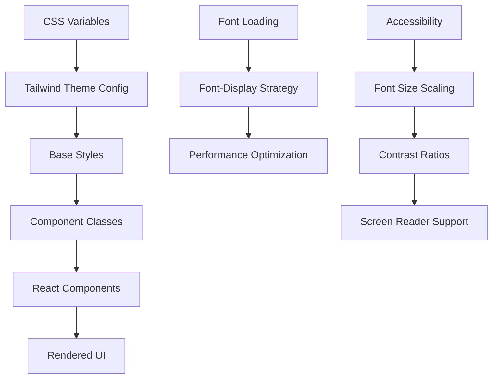
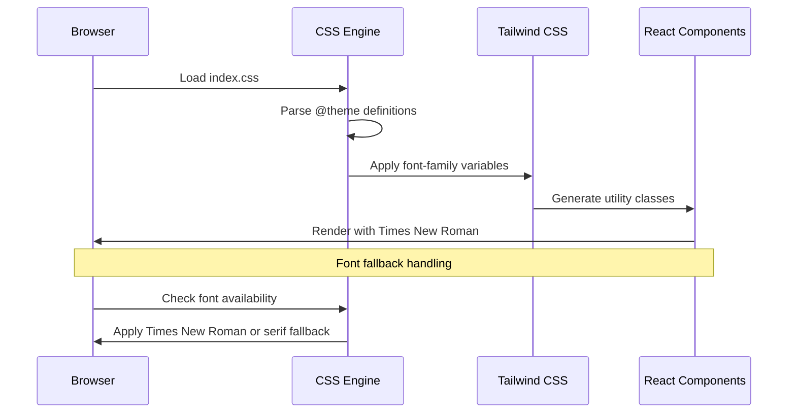

# Design Document: Font Times New Roman

## Overview

This feature implements a comprehensive typography update for the Byte Brothers portfolio website, transitioning from the current font stack (Inter, Space Grotesk, JetBrains Mono) to Times New Roman as the primary font family. The change affects the entire user interface including navigation, content areas, headings, and interactive elements while maintaining visual hierarchy and readability. The implementation leverages Tailwind CSS custom properties and CSS variables for consistent font application across all components.

## Architecture



## Sequence Diagrams



## Components and Interfaces

### Component 1: FontConfigManager

**Purpose**: Manages font configuration and loading strategy across the application

**Interface**:
```typescript
interface FontConfig {
  primary: string;
  display: string;  
  mono: string;
  fallbacks: string[];
}

interface FontLoadingStrategy {
  loadAsync(): Promise<boolean>;
  getFontStack(): string;
  isLoaded(): boolean;
}

class FontConfigManager implements FontLoadingStrategy {
  constructor(config: FontConfig);
  loadAsync(): Promise<boolean>;
  getFontStack(): string;
  isLoaded(): boolean;
  updateCSSVariables(): void;
}
```

**Responsibilities**:
- Define font family hierarchies with fallbacks
- Manage font loading performance
- Update CSS custom properties dynamically

### Component 2: TypographyTheme

**Purpose**: Centralizes typography theme configuration for Tailwind CSS

**Interface**:
```typescript
interface TypographyScale {
  xs: string;
  sm: string;
  base: string;
  lg: string;
  xl: string;
  '2xl': string;
  '3xl': string;
  '4xl': string;
  '5xl': string;
  '6xl': string;
}

interface TypographyTheme {
  fontFamily: FontConfig;
  fontSize: TypographyScale;
  lineHeight: Record<string, string>;
  fontWeight: Record<string, string>;
}
```

**Responsibilities**:
- Provide type-safe font configuration
- Ensure consistent typography scaling
- Support responsive typography

## Data Models

### Model 1: FontConfiguration

```typescript
interface FontConfiguration {
  name: string;
  stack: string[];
  cssVariable: string;
  loadingStrategy: 'swap' | 'fallback' | 'optional';
  preload: boolean;
}
```

**Validation Rules**:
- Font name must be non-empty string
- Stack must contain at least one fallback font
- CSS variable must follow valid CSS custom property naming

### Model 2: ComponentFontMapping

```typescript
interface ComponentFontMapping {
  componentName: string;
  fontUsage: {
    primary: boolean;
    display: boolean;
    mono: boolean;
  };
  customOverrides?: Record<string, string>;
}
```

**Validation Rules**:
- Component name must match existing React component
- At least one font usage type must be true
- Custom overrides must be valid CSS font-family values

## Algorithmic Pseudocode

### Main Font Application Algorithm

```typescript
ALGORITHM applyTimesNewRomanFont()
INPUT: currentThemeConfig of type TypographyTheme
OUTPUT: updatedThemeConfig of type TypographyTheme

BEGIN
  ASSERT currentThemeConfig !== null AND currentThemeConfig.isValid()
  
  // Step 1: Update primary font stack
  newFontStack ← ["Times New Roman", "Times", "serif"]
  
  // Step 2: Process each font category with validation
  FOR each category IN ["font-sans", "font-display", "font-mono"] DO
    ASSERT category.exists() IN currentThemeConfig
    
    IF category === "font-sans" OR category === "font-display" THEN
      currentThemeConfig[category] ← newFontStack
    ELSE
      // Preserve monospace for code elements
      currentThemeConfig[category] ← ["JetBrains Mono", "monospace"]
    END IF
  END FOR
  
  // Step 3: Update CSS custom properties
  cssVariables ← generateCSSVariables(currentThemeConfig)
  applyCSSVariables(cssVariables)
  
  ASSERT updatedThemeConfig.isConsistent() AND updatedThemeConfig.hasValidFallbacks()
  
  RETURN currentThemeConfig
END
```

**Preconditions:**
- currentThemeConfig is a valid TypographyTheme object
- CSS custom properties system is available
- Font loading mechanism is initialized

**Postconditions:**
- All text elements use Times New Roman as primary font
- Monospace font preserved for code elements
- CSS variables updated consistently
- Fallback fonts properly configured

**Loop Invariants:**
- All processed font categories maintain valid fallback chains
- CSS custom properties remain consistent throughout iteration

### Font Loading Optimization Algorithm

```typescript
ALGORITHM optimizeFontLoading()
INPUT: fontConfig of type FontConfiguration
OUTPUT: loadingResult of type boolean

BEGIN
  // Check font availability with early detection
  IF fontConfig.name === "Times New Roman" THEN
    // Times New Roman is system font on most platforms
    RETURN true
  END IF
  
  // Progressive enhancement strategy
  loadingPromises ← []
  
  FOR each fontVariant IN fontConfig.variants DO
    ASSERT fontVariant.isValidFormat()
    
    promise ← loadFontAsync(fontVariant)
    loadingPromises.add(promise)
  END FOR
  
  // Race condition handling with timeout
  result ← Promise.race([
    Promise.all(loadingPromises),
    timeoutPromise(3000) // 3 second timeout
  ])
  
  RETURN result.success
END
```

**Preconditions:**
- fontConfig contains valid font definitions
- Browser supports font loading API
- Network connectivity available (for web fonts)

**Postconditions:**
- Font loading completes within timeout period
- Fallback fonts activated if loading fails
- Performance metrics recorded for optimization

**Loop Invariants:**
- All font variants maintain proper loading state
- Loading promises resolve to valid font objects

## Key Functions with Formal Specifications

### Function 1: updateCSSFontVariables()

```typescript
function updateCSSFontVariables(fontConfig: FontConfiguration): void
```

**Preconditions:**
- `fontConfig` is non-null and contains valid font stack
- CSS custom properties are supported by browser
- Document root element is accessible

**Postconditions:**
- CSS custom properties updated with new font values
- All components automatically inherit new fonts
- Visual changes applied immediately without re-render

**Loop Invariants:** N/A (direct property assignment)

### Function 2: validateFontCompatibility()

```typescript
function validateFontCompatibility(fontName: string): Promise<boolean>
```

**Preconditions:**
- `fontName` is non-empty string
- Font loading API available
- Browser context is active

**Postconditions:**
- Returns true if font is available and renders correctly
- Returns false if font loading fails or compatibility issues detected
- No side effects on existing font configuration

**Loop Invariants:** N/A (single async operation)

### Function 3: applyResponsiveTypography()

```typescript
function applyResponsiveTypography(breakpoints: Record<string, number>): void
```

**Preconditions:**
- `breakpoints` contains valid screen size definitions
- Tailwind CSS responsive system is active
- Component tree is properly mounted

**Postconditions:**
- Typography scales appropriately across all screen sizes
- Font readability maintained at all breakpoints
- Performance impact minimized through CSS optimization

**Loop Invariants:**
- For typography application loops: All processed breakpoints maintain valid font sizing
- Responsive behavior remains consistent throughout viewport changes

## Example Usage

```typescript
// Example 1: Basic font configuration setup
const fontConfig: FontConfiguration = {
  name: "Times New Roman",
  stack: ["Times New Roman", "Times", "serif"],
  cssVariable: "--font-sans",
  loadingStrategy: "swap",
  preload: true
};

const fontManager = new FontConfigManager(fontConfig);
await fontManager.loadAsync();

// Example 2: Component-level font application
const NavbarWithNewFont: React.FC = () => {
  useEffect(() => {
    const config = {
      fontFamily: {
        primary: ["Times New Roman", "Times", "serif"],
        display: ["Times New Roman", "Times", "serif"], 
        mono: ["JetBrains Mono", "monospace"]
      }
    };
    
    updateCSSFontVariables(config.fontFamily.primary);
  }, []);

  return (
    <nav className="font-sans text-lg">
      <span className="font-display text-2xl">Byte Brothers</span>
    </nav>
  );
};

// Example 3: Complete theme integration
const themeConfig: TypographyTheme = {
  fontFamily: {
    primary: "Times New Roman, Times, serif",
    display: "Times New Roman, Times, serif",
    mono: "JetBrains Mono, monospace",
    fallbacks: ["serif", "sans-serif", "monospace"]
  },
  fontSize: {
    xs: "0.75rem",
    sm: "0.875rem", 
    base: "1rem",
    lg: "1.125rem",
    xl: "1.25rem"
  }
};

// Apply configuration
if (validateFontCompatibility("Times New Roman")) {
  applyTimesNewRomanFont(themeConfig);
  applyResponsiveTypography({
    sm: 640,
    md: 768, 
    lg: 1024,
    xl: 1280
  });
}
```

## Correctness Properties

The following properties must hold for the font system implementation:

**Property 1: Font Consistency**
```typescript
∀ component ∈ ReactComponents: 
  component.fontFamily === "Times New Roman" ∨ 
  component.fontFamily ∈ validFallbacks
```

**Property 2: Performance Boundaries**  
```typescript
∀ fontLoad ∈ FontLoadOperations:
  fontLoad.duration ≤ 3000ms ∧
  fontLoad.success ⟹ renderTime ≤ previousRenderTime + 10%
```

**Property 3: Accessibility Compliance**
```typescript  
∀ textElement ∈ DOMTextElements:
  contrastRatio(textElement.color, textElement.background) ≥ 4.5 ∧
  textElement.fontSize ≥ 16px ∨ textElement.isDecorative === true
```

**Property 4: Cross-Platform Compatibility**
```typescript
∀ platform ∈ [Windows, macOS, Linux, iOS, Android]:
  renderFont(platform, "Times New Roman") === expectedRendering ∨
  renderFont(platform, fallbackFont) === acceptableRendering
```

## Error Handling

### Error Scenario 1: Font Loading Failure

**Condition**: Times New Roman fails to load or is not available on the system
**Response**: Automatically fall back to Times font, then serif generic family
**Recovery**: 
- Log font loading failure for analytics
- Continue with fallback fonts seamlessly
- Provide user notification if font appearance significantly differs

### Error Scenario 2: CSS Variable Update Failure

**Condition**: CSS custom property update fails due to browser limitations
**Response**: Fall back to direct CSS class application
**Recovery**:
- Detect CSS custom property support
- Apply inline styles as fallback mechanism
- Maintain visual consistency across components

### Error Scenario 3: Performance Degradation

**Condition**: Font changes cause significant performance impact
**Response**: Implement progressive enhancement with measurement
**Recovery**:
- Monitor render performance metrics
- Revert to previous font if performance drops below threshold
- Provide user option to disable custom fonts

## Testing Strategy

### Unit Testing Approach

Test individual font configuration functions, CSS variable updates, and component font inheritance. Key test cases include font stack validation, CSS property generation, and fallback behavior verification. Use Jest with React Testing Library for component-level font application testing.

### Property-Based Testing Approach

**Property Test Library**: fast-check (JavaScript/TypeScript property-based testing)

Generate random font configurations and verify that:
- All font stacks contain valid fallbacks
- CSS variables are properly formatted
- Component font inheritance works correctly
- Performance remains within acceptable bounds across different configurations

Key properties to test:
- Font loading with various network conditions
- Responsive typography across random viewport sizes  
- Accessibility compliance with generated font/color combinations

### Integration Testing Approach

Test complete font theme application across multiple components simultaneously. Verify that navigation, content areas, modals, and interactive elements all properly inherit the new font family. Test font loading behavior under various network conditions and browser states.

## Performance Considerations

Font loading optimization through font-display: swap CSS property to prevent invisible text during font swap period. Preload Times New Roman font files if served from CDN to reduce loading latency. Implement font loading detection to measure impact on Core Web Vitals, particularly Largest Contentful Paint (LCP) and Cumulative Layout Shift (CLS). Use CSS containment for typography to optimize reflow operations.

## Security Considerations

Validate font sources to prevent CSS injection attacks through malicious font files. Implement Content Security Policy (CSP) restrictions for font loading from external domains. Ensure font loading URLs use HTTPS to prevent man-in-the-middle attacks. Monitor for potential privacy concerns related to font fingerprinting techniques.

## Dependencies

- **Tailwind CSS 4.1.14**: Custom theme configuration and utility classes
- **React 19.0.1**: Component architecture and state management  
- **TypeScript 5.8.2**: Type safety for font configuration interfaces
- **CSS Custom Properties**: Browser support for dynamic font updates
- **Font Loading API**: Modern browsers for optimal font loading detection