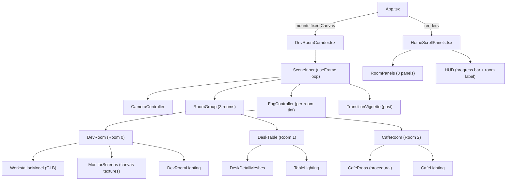
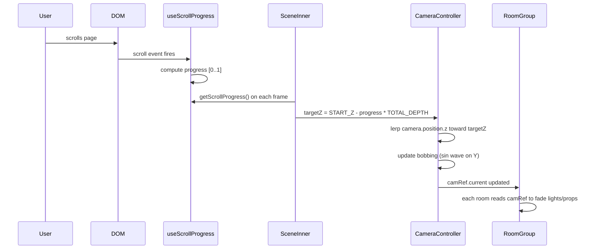
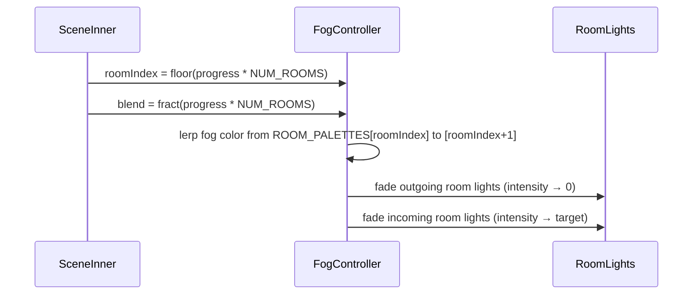

# Design Document: Immersive Dev Room Experience

## Overview

Replace the existing HomeCorridor 7-bay gallery with a scroll-driven 3D walk through three
distinct themed rooms — a Developer Room, a close-up Developer's Table, and a Café Room.
The camera travels forward through each space in sync with the page scroll position, and
content overlay panels (HomeScrollPanels) continue to render on the left side of the
viewport at each thematic section.

The feature extends (not replaces) the existing `HomeCorridor` / `HomeScrollPanels`
architecture: the new component `DevRoomCorridor` takes over as the home-page 3D scene
while `HomeScrollPanels` is updated to reference the new `NUM_ROOMS` constant instead of
`NUM_BAYS`.

---

## Architecture



---

## Sequence Diagrams

### Scroll-Driven Camera Walk



### Room Transition (Fog + Lighting Cross-Fade)



---

## Components and Interfaces

### DevRoomCorridor

**Purpose**: Root Three.js Canvas component, drop-in replacement for `HomeCorridor`.

**Interface**:
```typescript
interface DevRoomCorridorProps {
  reducedMotion?: boolean;   // honour prefers-reduced-motion
  visible?: boolean;         // opacity-driven show/hide (home tab only)
}

export const DevRoomCorridor: React.FC<DevRoomCorridorProps>
```

**Responsibilities**:
- Owns the fixed-position `<Canvas>` element
- Passes `reducedMotion` and `visible` down to `SceneInner`
- Suspends with `<Suspense>` to handle async GLB loading

---

### SceneInner

**Purpose**: Inner R3F component; owns camera animation loop.

**Interface**:
```typescript
interface SceneInnerProps {
  reducedMotion: boolean;
  visible: boolean;
}
```

**Responsibilities**:
- Reads `getScrollProgress()` each frame
- Drives `camera.position.z` via lerp (`LERP = 0.072`)
- Provides `CamCtx` (camera position ref) to all children
- Manages global fog and ambient light colours per active room

---

### DevRoom (Room 0)

**Purpose**: Full developer environment — the first room the camera enters.

**Interface**:
```typescript
interface DevRoomProps {
  roomZ: number;       // world-space Z centre for this room
  camRef: CamRef;      // shared camera position ref
}
```

**Responsibilities**:
- Positions the reused workstation GLB (`programmer_desk_setup__stylized_3d_room.glb`) at `roomZ`
- Adds procedural room geometry: floor, ceiling, walls (`ROOM_W × ROOM_H × ROOM_DEPTH`)
- Emits cool blue ambient lighting (`#1a3a6e`) + monitor cyan glow points
- Places 2–3 extra monitor planes with `MonitorCanvasTexture` for code animation
- Fades in/out based on camera proximity via `camRef`

---

### DeskTable (Room 1)

**Purpose**: Close-up zoomed view of the developer's desk.

**Interface**:
```typescript
interface DeskTableProps {
  roomZ: number;
  camRef: CamRef;
}
```

**Responsibilities**:
- Camera path drops slightly lower (`Y -= 0.5`) and FOV narrows (`50°`) for intimacy
- Procedural desk surface with sticky notes (coloured planes), coffee mug (cylinder stack),
  mechanical keyboard (box geometry grid), and a side monitor showing a code snippet
- Animated keyboard RGB strips (emissive color cycling on `useFrame`)
- Warm desk lamp spotlight (`#ffe8b0`, intensity driven by proximity)

---

### CafeRoom (Room 2)

**Purpose**: Warm café environment — the final room.

**Interface**:
```typescript
interface CafeRoomProps {
  roomZ: number;
  camRef: CamRef;
}
```

**Responsibilities**:
- Warm colour palette: fog `#3d2010`, ambient `#7a4a1e`, point lights `#ff9a3c`
- Procedural café props: wooden tables (box meshes, `roughness: 0.85`), hanging pendant
  lights (sphere + cylinder), coffee machine silhouette (box stack)
- Steam particle system over coffee cups (instanced planes, rising Y each frame)
- Soft bokeh-style glow on pendant lights via `PointLight` with high decay

---

## Data Models

### Room Definition

```typescript
interface RoomDefinition {
  id: 'dev-room' | 'desk-table' | 'cafe-room';
  label: string;           // HUD display name
  roomZ: number;           // world-space Z origin (computed from ROOM_DEPTH)
  cameraY: number;         // eye height override for this room
  cameraFov: number;       // FOV override (degrees)
  fogColor: number;        // THREE hex colour for scene fog
  fogNear: number;
  fogFar: number;
  ambientColor: number;    // ambient light hex
  ambientIntensity: number;
}
```

### Room Layout Constants

```typescript
const ROOM_DEPTH   = 20;   // depth of each room in world units
const ROOM_W       = 10;   // room half-width × 2
const ROOM_H       = 7;
const NUM_ROOMS    = 3;
const TOTAL_DEPTH  = ROOM_DEPTH * NUM_ROOMS;

const START_Z      = 10;   // camera Z at scroll = 0
const END_Z        = START_Z - TOTAL_DEPTH + ROOM_DEPTH / 2;

// Derived room centres
const ROOM_CENTRES: number[] = [0, 1, 2].map(
  i => START_Z - ROOM_DEPTH * i - ROOM_DEPTH / 2
);
```

### Room Palette Table

```typescript
const ROOMS: RoomDefinition[] = [
  {
    id: 'dev-room',
    label: 'Developer Room',
    roomZ: ROOM_CENTRES[0],
    cameraY: 1.6,
    cameraFov: 58,
    fogColor: 0x0a0f1e,
    fogNear: 10, fogFar: 55,
    ambientColor: 0x1a3a6e,
    ambientIntensity: 1.8,
  },
  {
    id: 'desk-table',
    label: "Developer's Table",
    roomZ: ROOM_CENTRES[1],
    cameraY: 1.1,   // lower, close-up
    cameraFov: 50,  // narrower
    fogColor: 0x0d1520,
    fogNear: 8, fogFar: 40,
    ambientColor: 0x0f2040,
    ambientIntensity: 1.5,
  },
  {
    id: 'cafe-room',
    label: 'Café Room',
    roomZ: ROOM_CENTRES[2],
    cameraY: 1.6,
    cameraFov: 58,
    fogColor: 0x3d2010,
    fogNear: 10, fogFar: 50,
    ambientColor: 0x7a4a1e,
    ambientIntensity: 1.4,
  },
];
```

### Scroll Panel Definition (extended from existing)

```typescript
// NUM_ROOMS replaces NUM_BAYS; 3 rooms → 3 panels per room section
// plus optional sub-panels per room = up to 9 total scroll bands
const ROOM_PANELS_PER_ROOM = 3;
const TOTAL_PANELS = NUM_ROOMS * ROOM_PANELS_PER_ROOM;  // 9
const SCROLL_HEIGHT_VH = TOTAL_PANELS * 120;            // 1080vh total
```

---

## Algorithmic Pseudocode

### Camera Animation Algorithm

```pascal
ALGORITHM animateCamera(scrollProgress, currentCamera, reducedMotion)
INPUT:  scrollProgress ∈ [0, 1]
        currentCamera: THREE.PerspectiveCamera
        reducedMotion: boolean
OUTPUT: mutated currentCamera.position

BEGIN
  // Determine active room index and blend factor
  roomFloat ← scrollProgress * NUM_ROOMS
  roomIndex ← clamp(floor(roomFloat), 0, NUM_ROOMS - 1)
  blend     ← fract(roomFloat)

  // Target position
  currentRoom ← ROOMS[roomIndex]
  nextRoom    ← ROOMS[min(roomIndex + 1, NUM_ROOMS - 1)]

  targetZ ← START_Z - scrollProgress * TOTAL_DEPTH
  targetY ← lerp(currentRoom.cameraY, nextRoom.cameraY, smoothstep(blend))
  targetFov ← lerp(currentRoom.cameraFov, nextRoom.cameraFov, smoothstep(blend))

  IF reducedMotion THEN
    camera.position.set(0, targetY, targetZ)
    camera.fov ← targetFov
  ELSE
    camera.position.z += (targetZ - camera.position.z) * LERP
    camera.position.y += (targetY - camera.position.y) * LERP
    bobOffset ← sin(clock.elapsedTime * 1.1) * BOB_AMP
    camera.position.y += bobOffset
    camera.fov += (targetFov - camera.fov) * LERP_FOV
  END IF

  camera.updateProjectionMatrix()
END
```

**Preconditions**:
- `scrollProgress` is normalised to [0, 1]
- `ROOMS` array has `NUM_ROOMS` entries with valid `cameraY` and `cameraFov`

**Postconditions**:
- `camera.position.z` monotonically decreases as scrollProgress increases
- `camera.fov` is always within [45°, 65°]
- No side effects on `ROOMS` array

**Loop Invariants**: N/A (stateless per-frame function)

---

### Fog Cross-Fade Algorithm

```pascal
ALGORITHM updateSceneFog(scrollProgress, fog, ambientLight)
INPUT:  scrollProgress ∈ [0, 1]
        fog: THREE.Fog
        ambientLight: THREE.AmbientLight
OUTPUT: mutated fog.color, ambientLight.color, ambientLight.intensity

BEGIN
  roomFloat ← scrollProgress * NUM_ROOMS
  roomIndex ← clamp(floor(roomFloat), 0, NUM_ROOMS - 1)
  nextIndex ← min(roomIndex + 1, NUM_ROOMS - 1)
  blend     ← smoothstep(fract(roomFloat))

  fog.color.lerpColors(
    ROOMS[roomIndex].fogColor,
    ROOMS[nextIndex].fogColor,
    blend
  )
  fog.near ← lerp(ROOMS[roomIndex].fogNear, ROOMS[nextIndex].fogNear, blend)
  fog.far  ← lerp(ROOMS[roomIndex].fogFar,  ROOMS[nextIndex].fogFar,  blend)

  ambientLight.color.lerpColors(
    ROOMS[roomIndex].ambientColor,
    ROOMS[nextIndex].ambientColor,
    blend
  )
  ambientLight.intensity ← lerp(
    ROOMS[roomIndex].ambientIntensity,
    ROOMS[nextIndex].ambientIntensity,
    blend
  )
END
```

**Preconditions**: `ROOMS[i].fogColor` and `ambientColor` are valid THREE.Color hex values.

**Postconditions**: Fog and ambient colour are always a valid interpolation between two adjacent room palettes, preventing harsh cuts.

### Room Prop Proximity Fade Algorithm

```pascal
ALGORITHM proximityFade(camZ, propZ, fadeRadius)
INPUT:  camZ: number (camera world Z)
        propZ: number (prop world Z anchor)
        fadeRadius: number (how far the fade extends)
OUTPUT: opacity ∈ [0, 1]

BEGIN
  dist ← abs(camZ - propZ)
  opacity ← clamp(1 - (dist / fadeRadius), 0, 1)
  RETURN smoothstep(opacity)
END
```

All room-specific lights, particles, and detail meshes use this function
to fade in as the camera approaches and out as it departs, keeping GPU
load proportional to visible content.

---

### Steam Particle System Algorithm

```pascal
ALGORITHM updateSteamParticles(particles, deltaTime, cupZ)
INPUT:  particles: SteamParticle[] (instanced mesh state)
        deltaTime: number
        cupZ: number

FOR each particle p IN particles DO
  ASSERT p.life ∈ [0, 1]

  p.y      ← p.y + p.speed * deltaTime
  p.life   ← p.life - deltaTime * 0.4
  p.alpha  ← p.life * 0.35   // fade out as life decreases
  p.scale  ← 1 + (1 - p.life) * 0.8  // expand as it rises

  IF p.life ≤ 0 THEN
    // respawn at cup position
    p.x    ← cupX + (random() - 0.5) * 0.15
    p.y    ← cupY + 0.1
    p.z    ← cupZ + (random() - 0.5) * 0.1
    p.life ← 0.6 + random() * 0.4
    p.speed ← 0.3 + random() * 0.2
  END IF

  updateInstanceMatrix(p)
END FOR
```

**Loop Invariant**: Every particle's `p.life` is always reset before reaching `< -0.1`, ensuring no NaN propagation in scale/alpha.

---

## Key Functions with Formal Specifications

### `useRoomProgress(scrollProgress: number): RoomProgress`

```typescript
interface RoomProgress {
  roomIndex: number;    // 0 | 1 | 2
  blend: number;        // 0..1 blend toward next room
  localT: number;       // normalised position within current room [0..1]
}

function useRoomProgress(scrollProgress: number): RoomProgress
```

**Preconditions**:
- `scrollProgress ∈ [0, 1]`

**Postconditions**:
- `roomIndex ∈ {0, 1, 2}`
- `blend ∈ [0, 1]`
- `localT ∈ [0, 1]`
- At `scrollProgress = 0`: `roomIndex = 0, blend = 0`
- At `scrollProgress = 1`: `roomIndex = 2, blend ≈ 1`

---

### `buildRoomGeometry(room: RoomDefinition): THREE.Group`

```typescript
function buildRoomGeometry(room: RoomDefinition): THREE.Group
```

**Preconditions**:
- `room.id` is one of the three valid room identifiers
- All geometry parameters (`ROOM_W`, `ROOM_H`, `ROOM_DEPTH`) are positive numbers

**Postconditions**:
- Returns a `THREE.Group` containing floor, ceiling, 3 walls (left, right, back) geometries
- All meshes use `MeshStandardMaterial` with room-appropriate roughness/colour values
- Group is centred at `[0, ROOM_H/2, room.roomZ]`
- No memory leaks: all geometries and materials stored in `useMemo` for disposal

---

### `createMonitorTexture(content: MonitorContent): CanvasTextureHandle`

```typescript
interface MonitorContent {
  type: 'code' | 'terminal' | 'matrix';
  language?: string;
  lines?: string[];
}

interface CanvasTextureHandle {
  texture: THREE.CanvasTexture;
  draw: (time: number) => void;  // called each frame
  dispose: () => void;
}

function createMonitorTexture(content: MonitorContent): CanvasTextureHandle
```

**Preconditions**:
- `content.type` is a valid string enum value
- Called inside a browser context (document exists)

**Postconditions**:
- Returns a handle with a live `THREE.CanvasTexture`
- `draw()` updates the canvas and sets `texture.needsUpdate = true`
- `dispose()` disposes the texture and nulls references

---

### `smoothstep(t: number): number`

```typescript
function smoothstep(t: number): number
// Ken Perlin's smoothstep: 3t² - 2t³
```

**Preconditions**: `t ∈ [0, 1]`

**Postconditions**:
- `smoothstep(0) = 0`
- `smoothstep(1) = 1`
- `smoothstep(0.5) = 0.5`
- First derivative = 0 at both endpoints (smooth entry/exit)

---

## Example Usage

### Wiring DevRoomCorridor into App.tsx

```typescript
// App.tsx — replace HomeCorridor with DevRoomCorridor
import { DevRoomCorridor } from './components/home/DevRoomCorridor';

// In JSX (same mounting pattern as HomeCorridor):
{use3DCorridor && (
  <DevRoomCorridor
    visible={activeTab === 'home'}
    reducedMotion={reducedMotion}
  />
)}
```

### Room-Aware Scroll Panels

```typescript
// HomeScrollPanels.tsx — updated import
import { NUM_ROOMS, ROOMS } from './DevRoomCorridor';

// Scroll track height drives 3 rooms × 3 panels each = 9 × 120vh
<div id="scroll-track" style={{ height: `${NUM_ROOMS * 3 * 120}vh` }} />
```

### Proximity Fade Usage (inside a room component)

```typescript
// Inside DevRoom component's useFrame
useFrame(() => {
  const camZ = camRef.current.z;
  const fade = proximityFade(camZ, roomZ, ROOM_DEPTH * 1.2);
  
  if (spotRef.current) {
    spotRef.current.intensity = fade * MAX_SPOT_INTENSITY;
  }
  if (particleMat.current) {
    particleMat.current.opacity = fade * 0.7;
  }
});
```

### DevRoom GLB Integration

```typescript
// DevRoom.tsx — reuses WorkstationScene pattern
const { scene } = useGLTF('/workstation/programmer_desk_setup__stylized_3d_room.glb');

const cloned = useMemo(() => {
  const c = cloneSceneGraph(scene);
  configureSceneMaterials(c, monitorTex.texture, brushedMetalMap);
  return c;
}, [scene, monitorTex.texture, brushedMetalMap]);

return (
  <group position={[0, 0, roomZ]}>
    <primitive object={cloned} scale={0.65} position={[1.5, 0, 0]} dispose={null} />
    <DevRoomLighting camRef={camRef} roomZ={roomZ} />
    <MonitorScreens count={2} roomZ={roomZ} camRef={camRef} />
  </group>
);
```

---

## Correctness Properties

*A property is a characteristic or behavior that should hold true across all valid executions of a system — essentially, a formal statement about what the system should do. Properties serve as the bridge between human-readable specifications and machine-verifiable correctness guarantees.*

### Property 1: Monotonic Z Travel

For any `s1 < s2` in [0, 1], `cameraZ(s1) > cameraZ(s2)` — the camera always moves forward, never backward.

**Validates: Requirements 2.7**

### Property 2: useRoomProgress Output Invariants

For any `scrollProgress` in [0, 1], `useRoomProgress` returns `roomIndex ∈ {0, 1, 2}`, `blend ∈ [0, 1]`, and `localT ∈ [0, 1]`.

**Validates: Requirements 3.2, 3.3, 3.4**

### Property 3: Camera Transition Bounds

For any `scrollProgress` in [0, 1], `camera.fov` is always in [45°, 65°] and `camera.position.y` is always in the range spanned by the minimum and maximum `cameraY` values across all `RoomDefinition` entries.

**Validates: Requirements 2.6, 2.3**

### Property 4: Reduced-Motion Snap

For any `scrollProgress` in [0, 1], when `reducedMotion` is `true`, `camera.position.z` equals exactly `START_Z − scrollProgress × TOTAL_DEPTH` after the frame update — no lerp lag.

**Validates: Requirements 2.4, 14.1**

### Property 5: Fog Cross-Fade Continuity and Channel Bounds

For any `scrollProgress` in [0, 1], all fog colour channel values and ambient light colour channel values are in [0, 1], and for any two adjacent scroll values `s` and `s + ε`, the absolute change in each colour channel is bounded proportionally to `ε` (no step discontinuities).

**Validates: Requirements 6.4, 6.5**

### Property 6: ProximityFade Bounds

For any `camZ`, `propZ`, and positive `fadeRadius`, `proximityFade(camZ, propZ, fadeRadius)` returns a value in [0, 1].

**Validates: Requirements 7.1, 7.3**

### Property 7: Room Light Containment

At any given `scrollProgress`, at most two rooms (the current room and the next room) have non-zero light intensity; all other rooms have zero light intensity.

**Validates: Requirements 7.6**

### Property 8: Steam Particle Lifecycle Invariant

After any number of frame updates, every `SteamParticle` in the café steam system has `life ∈ [0, 1]`; no particle ever has `life < 0` or a stale instance matrix.

**Validates: Requirements 8.3, 8.4**

### Property 9: GLB Clone Non-Mutation

For any call to `cloneSceneGraph(scene)` followed by `configureSceneMaterials(clone, ...)`, the original `scene` object's material references remain unchanged.

**Validates: Requirements 9.2**

### Property 10: buildRoomGeometry Structural Correctness

For any valid `RoomDefinition` (with a recognised `id` and positive geometry constants), `buildRoomGeometry` returns a non-empty `THREE.Group` containing at least five meshes (floor, ceiling, left wall, right wall, back wall) and does not throw an exception.

**Validates: Requirements 5.1, 5.4**

### Property 11: smoothstep Monotonicity

For any `t1 < t2` in [0, 1], `smoothstep(t1) ≤ smoothstep(t2)` — the function is monotonically non-decreasing over its domain.

**Validates: Requirements 16.3**

### Property 12: Scroll Height and Progress Consistency

For the DOM element `scroll-track`, its height equals `NUM_ROOMS × PANELS_PER_ROOM × 120vh`; when the page is scrolled to its maximum position, `getScrollProgress()` returns `1` and the camera is at `END_Z`.

**Validates: Requirements 11.2**

---

## Error Handling

### GLB Load Failure

**Condition**: `useGLTF` fails to fetch the workstation model (network error, missing file).

**Response**: `<Suspense fallback>` renders a plain `<meshStandardMaterial>` box at the same position, preserving room geometry without crashing.

**Recovery**: Hot-reload or navigation refresh. A console warning is emitted.

### WebGL Context Loss

**Condition**: GPU driver resets the WebGL context during extended use.

**Response**: R3F's built-in `onCreated` registers `context.addEventListener('webglcontextlost', ...)` which pauses the render loop. `HomeMobileFallback` is shown.

**Recovery**: `webglcontextrestored` re-initialises the renderer automatically.

### Scroll Track Not Found

**Condition**: `document.getElementById('scroll-track')` returns `null` during `useScrollProgress`.

**Response**: `scrollProgressRef.current` is set to `0` and a warning is logged. Camera stays at `START_Z`.

**Recovery**: React re-renders the DOM panel which injects the `scroll-track` div; the hook reattaches on the next scroll event.

---

## Testing Strategy

### Unit Testing

- `useRoomProgress`: verify `roomIndex`, `blend`, `localT` for boundary inputs (0, 0.5, 1, 0.333, 0.666)
- `smoothstep`: verify output at 0, 0.5, 1 and monotonicity over [0,1]
- `proximityFade`: verify returns 1.0 at `dist=0`, 0.0 at `dist=fadeRadius`, smooth in between
- `buildRoomGeometry`: verify returned group has correct child count and no NaN positions

### Property-Based Testing

**Library**: `fast-check`

- For all `s ∈ [0,1]`: `cameraZ(s)` is monotonically decreasing
- For all `s ∈ [0,1]`: `smoothstep(s) ∈ [0,1]` and `smoothstep` is monotone
- For all valid `RoomDefinition`: `buildRoomGeometry` never throws and returns a non-empty group
- For any sequence of scroll values: fog colour channels are always in [0, 1]

### Visual / Integration

- Manual scroll test: verify all three rooms are visually distinct and transitions are smooth
- Performance budget: maintain ≥ 55 fps on a mid-range GPU at 1440p with DPR 1.5
- `prefers-reduced-motion`: verify camera snaps (no lerp) and particles are disabled

---

## Performance Considerations

- **Instanced meshes** for particles, sticky notes, keyboard keys — avoid per-mesh draw calls
- **Geometry sharing**: floor/ceiling use the same `PlaneGeometry` reference across rooms
- **Visibility culling**: rooms outside `[camZ - ROOM_DEPTH, camZ + ROOM_DEPTH]` set `group.visible = false`
- **DPR cap**: Canvas uses `dpr={[1, 1.5]}` — never exceeds 1.5× pixel ratio
- **Texture atlas**: all procedural canvas textures share a single 2048×1152 canvas per monitor
- **LOD for GLB**: on devices with `hardwareConcurrency ≤ 4`, GLB is rendered at 50% scale with a simpler material set

---

## Security Considerations

- All Unsplash / external image URLs loaded via `THREE.TextureLoader` are HTTPS only
- No user input is passed to canvas draw calls — all text content is hard-coded string literals
- GLB is served from `/public/workstation/` (local, no CDN dependency for the model)

---

## Dependencies

| Package | Version | Purpose |
|---|---|---|
| `@react-three/fiber` | `^8.x` | React renderer for Three.js |
| `@react-three/drei` | `^9.x` | `useGLTF`, `Float`, `Suspense` helpers |
| `three` | `^0.160.x` | Core 3D engine |
| `react` | `^18.x` | Component model |
| `typescript` | `^5.x` | Type safety |
| `fast-check` | `^3.x` | Property-based testing |
| `vite` | `^5.x` | Build tooling |

All dependencies already present in `package.json`; `fast-check` may need to be added as a dev dependency if not already installed.
