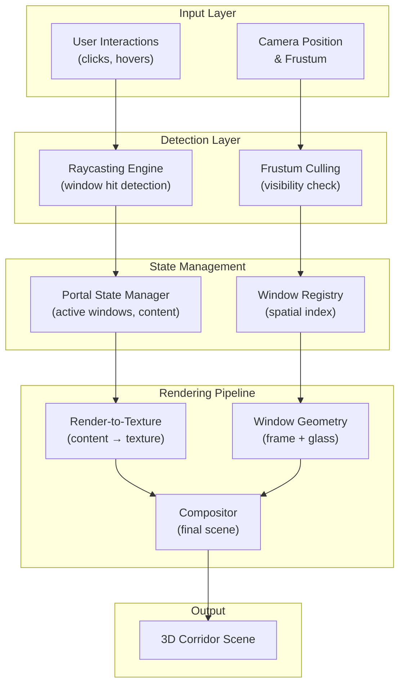

# Design Document: Interactive Portal Windows

## Overview

The Interactive Portal Windows feature enhances the Byte Brothers 3D corridor with clickable, interactive portals mounted on walls and gallery shelves. Each window displays a miniature version of different website sections (Portfolio, Services, About, Contact) rendered via Three.js render-to-texture, enabling users to explore content without leaving the immersive corridor experience. Windows support simultaneous activation, hover feedback, smooth transitions, and lazy-loaded portal content for optimal performance.

This feature combines high-fidelity 3D window geometry (with brass/steel frames, reflective glass, and dynamic lighting) with efficient render-to-texture content delivery to maintain 60fps performance in the existing Three.js/React Three Fiber architecture.

## High-Level Architecture



## System Components and Interfaces

### 1. Window Geometry Component

**Purpose**: Creates realistic 3D window frames with glass material and supports multiple sizes

**TypeScript Interface**:
```typescript
interface WindowConfig {
  id: string;
  position: [number, number, number];
  rotation: [number, number, number];
  size: 'small' | 'medium' | 'large';
  frameColor: number;
  metalness: number;
  roughness: number;
}

interface WindowGeometryProps {
  config: WindowConfig;
  onInteract: (windowId: string) => void;
}

interface WindowFrameGeometry {
  frame: THREE.BoxGeometry;
  glass: THREE.PlaneGeometry;
  trim: THREE.BoxGeometry;
}
```

**Responsibilities**:
- Generate frame geometry based on window size
- Create glass material with proper transparency and reflectivity
- Apply brass/steel trim materials
- Handle hover state visualization (glow, brightening)
- Provide bounding geometry for raycasting

### 2. Portal State Manager

**Purpose**: Manages the state of all active portals, content rendering, and performance constraints

**TypeScript Interface**:
```typescript
interface PortalState {
  windowId: string;
  contentType: 'portfolio' | 'services' | 'about' | 'contact';
  isActive: boolean;
  isLoading: boolean;
  texture?: THREE.Texture;
  openProgress: number; // 0-1 animation progress
}

interface PortalStateManager {
  activatePortal(windowId: string, contentType: string): void;
  deactivatePortal(windowId: string): void;
  getPortalState(windowId: string): PortalState | null;
  getActivePortals(): PortalState[];
  canActivatePortal(): boolean; // checks cap constraint
  updateProgress(windowId: string, progress: number): void;
}
```

**Responsibilities**:
- Track active portal windows (limited to 3 simultaneous)
- Manage portal open/close animations
- Queue portal content loading
- Enforce performance constraints
- Provide state queries for rendering

```

## Component Hierarchy and Data Flow

```mermaid
graph TD
    A["HomeCorridor<br/>(Scene Root)"]
    B["PortalSystem<br/>(State + Context)"]
    C["WindowRegistry<br/>(spatial index)"]
    D["RenderToTexture<br/>(RTT Manager)"]
    E["WindowMesh<br/>(frame geometry)"]
    F["Portal Content<br/>(React component)"]
    
    A --> B
    B --> C
    B --> D
    C --> E
    D --> F
    E --> A
    
    style A fill:#2c3e50
    style B fill:#3498db
    style C fill:#9b59b6
    style D fill:#e74c3c
    style E fill:#f39c12
    style F fill:#27ae60
```



## Components and Interfaces

### 1. Window Geometry Component

**Purpose**: Creates realistic 3D window frames with glass material and supports multiple sizes

**TypeScript Interface**:
```typescript
interface WindowConfig {
  id: string;
  position: [number, number, number];
  rotation: [number, number, number];
  size: 'small' | 'medium' | 'large';
  frameColor: number;
  metalness: number;
  roughness: number;
}

interface WindowGeometryProps {
  config: WindowConfig;
  onInteract: (windowId: string) => void;
}

interface WindowFrameGeometry {
  frame: THREE.BoxGeometry;
  glass: THREE.PlaneGeometry;
  trim: THREE.BoxGeometry;
}
```

**Responsibilities**:
- Generate frame geometry based on window size
- Create glass material with proper transparency and reflectivity
- Apply brass/steel trim materials
- Handle hover state visualization (glow, brightening)
- Provide bounding geometry for raycasting

### 2. Portal State Manager

**Purpose**: Manages the state of all active portals, content rendering, and performance constraints

**TypeScript Interface**:
```typescript
interface PortalState {
  windowId: string;
  contentType: 'portfolio' | 'services' | 'about' | 'contact';
  isActive: boolean;
  isLoading: boolean;
  texture?: THREE.Texture;
  openProgress: number; // 0-1 animation progress
}

interface PortalStateManager {
  activatePortal(windowId: string, contentType: string): void;
  deactivatePortal(windowId: string): void;
  getPortalState(windowId: string): PortalState | null;
  getActivePortals(): PortalState[];
  canActivatePortal(): boolean; // checks cap constraint
  updateProgress(windowId: string, progress: number): void;
}
```

**Responsibilities**:
- Track active portal windows (limited to 3 simultaneous)
- Manage portal open/close animations
- Queue portal content loading
- Enforce performance constraints
- Provide state queries for rendering

### 3. Raycasting Engine

**Purpose**: Detects window clicks and hover interactions with efficient spatial indexing

**TypeScript Interface**:
```typescript
interface RaycastTarget {
  windowId: string;
  geometry: THREE.BufferGeometry;
  position: THREE.Vector3;
  rotation: THREE.Euler;
}

interface RaycastResult {
  hit: boolean;
  windowId?: string;
  distance: number;
  point: THREE.Vector3;
}

interface RaycastEngine {
  addTarget(target: RaycastTarget): void;
  removeTarget(windowId: string): void;
  raycast(raycaster: THREE.Raycaster, camera: THREE.Camera): RaycastResult | null;
  getHoveredWindow(): string | null;
}
```

**Responsibilities**:
- Maintain spatial index of window bounding boxes
- Perform efficient raycasting from camera through mouse position
- Detect hover state changes
- Cache results to avoid redundant calculations
- Clean up geometry on window removal

### 4. Render-to-Texture Manager

**Purpose**: Renders React component content to Three.js texture for display in window portals

**TypeScript Interface**:
```typescript
interface RenderTarget {
  width: number;
  height: number;
  contentComponent: React.ComponentType;
  contentProps: any;
}

interface RenderToTextureManager {
  createRenderTarget(windowId: string, config: RenderTarget): void;
  updateContent(windowId: string, newProps: any): void;
  getTexture(windowId: string): THREE.Texture | null;
  dispose(windowId: string): void;
}
```

**Responsibilities**:
- Create offscreen React render contexts
- Convert React DOM to Three.js WebGLRenderTarget
- Lazy-load portal content on first activation
- Update content dynamically
- Clean up GPU resources when portals close

### 5. Glass Shader Material

**Purpose**: Implements realistic glass with reflections, refractions, and transparency

**GLSL Shader Concepts**:
```glsl
// Fragment Shader
uniform sampler2D uEnvironmentMap;
uniform sampler2D uNormalMap;
uniform float uFresnel;
uniform float uRefractiveIndex;

void main() {
  // Calculate fresnel effect (more reflection at grazing angles)
  float fresnel = calculateFresnel(normalize(vNormal), normalize(vViewDir), uFresnel);
  
  // Sample environment map for reflection
  vec3 reflection = texture(uEnvironmentMap, reflectionUV).rgb;
  
  // Calculate refraction direction
  vec3 refraction = refract(vViewDir, normalize(vNormal), uRefractiveIndex);
  
  // Blend reflection and refraction based on fresnel
  vec3 final = mix(refraction, reflection, fresnel);
  
  gl_FragColor = vec4(final, 0.8);
}
```

**Responsibilities**:
- Compute fresnel effect for angle-dependent reflection
- Sample environment map for realistic reflections
- Apply normal mapping for glass surface detail
- Blend reflection/refraction for realism
- Optimize shader for multiple simultaneous windows

## Data Models

### Window Configuration Model

```typescript
interface WindowDefinition {
  id: string;
  label: string;
  bay: number; // which bay this window is in
  side: 'left' | 'right';
  heightOffset: number; // vertical position in bay
  size: 'small' | 'medium' | 'large';
  frameColor: number; // hex color
  contentType: 'portfolio' | 'services' | 'about' | 'contact';
}

interface WindowDimensions {
  small: { width: 2.0, height: 1.5, frameThickness: 0.12 };
  medium: { width: 3.2, height: 2.0, frameThickness: 0.14 };
  large: { width: 4.8, height: 3.2, frameThickness: 0.16 };
}

interface WindowFrameMaterial {
  frame: {
    color: number;
    metalness: 0.7;
    roughness: 0.3;
  };
  glass: {
    color: 0xccddff;
    metalness: 0.0;
    roughness: 0.1;
    transparent: true;
    opacity: 0.75;
  };
}
```

### Portal Content Model

```typescript
interface PortalContent {
  windowId: string;
  contentType: string;
  data: {
    title: string;
    description: string;
    sections: ContentSection[];
  };
}

interface ContentSection {
  id: string;
  title: string;
  content: string | React.ReactNode;
  interactive: boolean; // whether user can click/scroll within this section
}

interface RenderTargetSpec {
  windowId: string;
  width: number;
  height: number;
  pixelRatio: 0.5; // lower ratio for performance
  component: React.ComponentType<{ content: PortalContent }>;
}
```

### Animation State Model

```typescript
interface WindowAnimationState {
  windowId: string;
  phase: 'idle' | 'hover' | 'opening' | 'open' | 'closing' | 'closed';
  progress: number; // 0-1 for opening/closing
  glowIntensity: number;
  scale: number;
  opacity: number;
}

type AnimationPhaseTransition = {
  from: WindowAnimationState['phase'];
  to: WindowAnimationState['phase'];
  duration: number; // ms
};
```

## Algorithm: Window Geometry Generation

```pascal
ALGORITHM generateWindowGeometry(config: WindowConfig)
INPUT: config with size, position, rotation, colors
OUTPUT: frameGeo, glassGeo, trimGeo

BEGIN
  ASSERT config.size ∈ {'small', 'medium', 'large'}
  
  dimensions ← lookupDimensions(config.size)
  LET width = dimensions.width
  LET height = dimensions.height
  LET frameThickness = dimensions.frameThickness
  
  // Generate outer frame box (brass/steel trim)
  outerBox ← createBox(width + frameThickness*2, height + frameThickness*2, frameThickness)
  
  // Generate inner glass pane
  glasPane ← createPlane(width, height)
  
  // Generate frame trim (edges)
  trimBox ← createBox(frameThickness, frameThickness, frameThickness)
  
  // Apply transformations
  FOR each edge IN [top, bottom, left, right] DO
    edgePos ← calculateEdgePosition(edge, width, height)
    trimInstances.add(trimBox at edgePos)
  END FOR
  
  // Apply materials
  frameMaterial ← createMaterial(config.frameColor, metalness=0.7, roughness=0.3)
  glassMaterial ← createMaterial(0xccddff, metalness=0.0, roughness=0.1, transparent=true)
  
  ASSERT outerBox.vertices.length > 0
  ASSERT glasPane.vertices.length > 0
  ASSERT trimInstances.length = 4
  
  RETURN {frame: outerBox, glass: glasPane, trim: trimInstances}
END
```

**Preconditions**:
- config.size must be valid enum value
- config.position is valid 3D coordinate
- config.frameColor is valid hex number

**Postconditions**:
- All geometries are properly indexed and buffered
- Frame and glass are positioned relative to origin
- Materials are applied with correct metallic properties
- Geometries ready for rendering

## Algorithm: Raycasting Hit Detection

```pascal
ALGORITHM raycastWindowDetection(mouseX, mouseY, camera, windows)
INPUT: mouse coordinates, camera, active windows list
OUTPUT: RaycastResult with window hit or null

BEGIN
  ASSERT mouseX ∈ [0, viewportWidth]
  ASSERT mouseY ∈ [0, viewportHeight]
  
  // Normalize mouse coordinates to NDC [-1, 1]
  ndcX ← (mouseX / viewportWidth) * 2 - 1
  ndcY ← -(mouseY / viewportHeight) * 2 + 1
  
  // Create raycaster from camera through mouse position
  ray ← raycaster.setFromCamera({x: ndcX, y: ndcY}, camera)
  
  closest ← null
  minDistance ← INFINITY
  
  FOR each window IN windows DO
    IF NOT isWindowVisible(window, camera) THEN
      CONTINUE
    END IF
    
    // Get bounding geometry for this window
    boundingGeo ← window.getBoundingGeometry()
    
    // Cast ray against window bounding box
    intersections ← ray.intersectGeometry(boundingGeo)
    
    IF intersections.length > 0 THEN
      intersection ← intersections[0]  // closest hit point
      
      IF intersection.distance < minDistance THEN
        minDistance ← intersection.distance
        closest ← {
          windowId: window.id,
          point: intersection.point,
          distance: intersection.distance,
          hit: true
        }
      END IF
    END IF
  END FOR
  
  ASSERT closest = null OR closest.distance > 0
  
  RETURN closest
END
```

**Preconditions**:
- mouseX and mouseY are valid screen coordinates
- camera is properly initialized with projection matrix
- windows list is non-empty

**Postconditions**:
- Returns closest window hit or null
- All returned distances are positive
- Hit point lies on window surface

## Algorithm: Portal Activation with Performance Cap

```pascal
ALGORITHM activatePortal(windowId, contentType, stateManager)
INPUT: windowId to activate, content type, state manager
OUTPUT: success boolean

BEGIN
  ASSERT windowId ≠ null AND contentType ≠ null
  
  // Check if already active
  existingPortal ← stateManager.getPortalState(windowId)
  IF existingPortal ≠ null AND existingPortal.isActive THEN
    RETURN false  // Already active
  END IF
  
  // Count currently active portals
  activeCount ← stateManager.getActivePortals().length
  MAX_PORTALS ← 3
  
  IF activeCount ≥ MAX_PORTALS THEN
    // Find oldest portal and deactivate
    oldestPortal ← stateManager.getActivePortals()[0]
    stateManager.deactivatePortal(oldestPortal.windowId)
    activeCount ← activeCount - 1
  END IF
  
  ASSERT activeCount < MAX_PORTALS
  
  // Create portal state
  portalState ← {
    windowId: windowId,
    contentType: contentType,
    isActive: true,
    isLoading: true,
    openProgress: 0,
    texture: null
  }
  
  // Queue async content loading
  AsyncQueue.enqueue({
    action: "loadPortalContent",
    windowId: windowId,
    contentType: contentType,
    callback: onContentReady(portalState)
  })
  
  // Register portal
  stateManager.registerPortal(portalState)
  
  // Start opening animation
  animate(portalState, {
    targetProgress: 1.0,
    duration: 300  // ms
  })
  
  RETURN true
END
```

**Preconditions**:
- windowId references existing window
- contentType is valid
- stateManager is initialized

**Postconditions**:
- Portal marked as active
- Content loading initiated asynchronously
- Active portal count ≤ 3
- Opening animation queued

## Algorithm: Render-to-Texture Pipeline

```pascal
ALGORITHM renderPortalContentToTexture(windowId, contentComponent, contentData)
INPUT: windowId, React component, portal content data
OUTPUT: THREE.Texture ready for window display

BEGIN
  ASSERT windowId ≠ null
  ASSERT contentComponent is valid React component
  
  // Determine render target dimensions based on window size
  windowSize ← getWindowSize(windowId)
  targetWidth ← windowSize.width * 256  // pixels
  targetHeight ← windowSize.height * 256
  pixelRatio ← 0.5  // lower ratio for performance
  
  effectiveWidth ← targetWidth * pixelRatio
  effectiveHeight ← targetHeight * pixelRatio
  
  ASSERT effectiveWidth > 0 AND effectiveHeight > 0
  
  // Create WebGL render target
  renderTarget ← new THREE.WebGLRenderTarget(
    effectiveWidth,
    effectiveHeight,
    {format: THREE.RGBAFormat, type: THREE.UnsignedByteType}
  )
  
  // Create temporary React DOM container
  container ← createOffscreenContainer()
  root ← ReactDOM.createRoot(container)
  
  // Render React component to DOM
  root.render(
    <PortalContentRenderer data={contentData} />
  )
  
  // Convert DOM to canvas
  canvas ← html2canvas(container, {
    width: effectiveWidth,
    height: effectiveHeight,
    pixelRatio: 1.0
  })
  
  // Upload canvas to WebGL texture
  texture ← new THREE.CanvasTexture(canvas)
  texture.magFilter ← THREE.LinearFilter
  texture.minFilter ← THREE.LinearFilter
  
  // Create material for window glass using texture
  materialData ← {
    map: texture,
    transparent: true,
    opacity: 0.85
  }
  
  // Cache texture in state manager
  stateManager.setPortalTexture(windowId, texture)
  
  // Cleanup
  root.unmount()
  container.remove()
  
  ASSERT texture ≠ null
  ASSERT texture.image ≠ null
  
  RETURN texture
END
```

**Preconditions**:
- windowId references existing window
- contentComponent is mounted and renderable
- WebGL context available

**Postconditions**:
- Texture uploaded to GPU VRAM
- Content cached in state manager
- Original React DOM cleanup complete
- Texture ready for window material

## Key Functions with Formal Specifications

### Function 1: calculateWindowPosition()

```typescript
function calculateWindowPosition(
  bayIndex: number,
  side: 'left' | 'right',
  heightOffset: number,
  bayCfg: CorridorConfig
): [number, number, number]
```

**Preconditions**:
- `bayIndex >= 0 && bayIndex < numBays`
- `heightOffset >= 0 && heightOffset <= HALF_HEIGHT`
- `side ∈ {'left', 'right'}`
- `bayCfg.baydepth > 0 && bayCfg.halfWidth > 0`

**Postconditions**:
- Returns 3D position `[x, y, z]` where:
  - `x = ±bayCfg.halfWidth - 0.15` (wall offset)
  - `y = bayCfg.height / 2 + heightOffset`
  - `z = bayCfg.baydepth * bayIndex` (in corridor space)
- Position lies on corridor wall
- Position is reachable by raycasting from camera

### Function 2: isWindowInFrustum()

```typescript
function isWindowInFrustum(
  windowPos: THREE.Vector3,
  windowSize: number,
  camera: THREE.Camera,
  cullingDistance: number
): boolean
```

**Preconditions**:
- `windowPos` is valid 3D coordinate
- `windowSize > 0`
- `camera` has valid projection matrix
- `cullingDistance > 0`

**Postconditions**:
- Returns `true` if window is visible in camera frustum
- Returns `true` only if camera distance to window ≤ `cullingDistance`
- Result valid until next camera update
- No side effects on input parameters

### Function 3: animatePortalOpening()

```typescript
function animatePortalOpening(
  windowId: string,
  startTime: number,
  duration: number,
  onProgress: (progress: number) => void,
  onComplete: () => void
): void
```

**Preconditions**:
- `windowId` references active portal
- `duration > 0`
- `onProgress` and `onComplete` are callable
- Portal in 'opening' phase

**Postconditions**:
- Animation runs for exactly `duration` milliseconds
- `onProgress` called with values from 0.0 → 1.0
- `onComplete` called exactly once when animation finishes
- Easing applied: cubic ease-out
- No side effects after `onComplete` call

### Function 4: handleWindowInteraction()

```typescript
function handleWindowInteraction(
  event: PointerEvent,
  camera: THREE.Camera,
  windowRegistry: WindowRegistry,
  stateManager: PortalStateManager
): void
```

**Preconditions**:
- `event` is valid PointerEvent with clientX/clientY
- `camera` is properly initialized
- `windowRegistry` contains all window definitions
- `stateManager` is initialized

**Postconditions**:
- If pointer over window: hover state activated, glow applied
- If click on window: portal activation queued via `stateManager`
- If no window hit: all hover states cleared
- No portal activated if max concurrent portals reached (handled by state manager)
- Event not modified

## Example Usage

### Creating a Portal Window in the Corridor

```typescript
// In HomeCorridor or GalleryScene component
const windowConfig: WindowConfig = {
  id: 'window-portfolio-1',
  position: [-4.8, 3.2, -28],
  rotation: [0, Math.PI / 2, 0],
  size: 'medium',
  frameColor: 0xc9a876,  // brass
  metalness: 0.7,
  roughness: 0.3,
};

// Window component with hover/click handling
<WindowMesh
  config={windowConfig}
  isHovered={hoveredWindowId === 'window-portfolio-1'}
  isActive={activePortals.some(p => p.windowId === 'window-portfolio-1')}
  onHover={() => setHoveredWindowId('window-portfolio-1')}
  onUnhover={() => setHoveredWindowId(null)}
  onClick={() => portalManager.activatePortal('window-portfolio-1', 'portfolio')}
/>
```

### Portal Content Display

```typescript
// Render portal content inside window
{activePortals.map(portal => (
  <PortalDisplay
    key={portal.windowId}
    windowId={portal.windowId}
    contentType={portal.contentType}
    progress={portal.openProgress}
    texture={portal.texture}
    isLoading={portal.isLoading}
  />
))}
```

### Handling Window Interaction

```typescript
// In Canvas useFrame or event handler
const handlePointerMove = (event: PointerEvent) => {
  const raycaster = new THREE.Raycaster();
  const mouse = new THREE.Vector2(
    (event.clientX / window.innerWidth) * 2 - 1,
    -(event.clientY / window.innerHeight) * 2 + 1
  );
  
  raycaster.setFromCamera(mouse, camera);
  const hit = raycastEngine.raycast(raycaster, camera);
  
  if (hit) {
    onWindowHovered(hit.windowId);
  } else {
    onWindowUnhovered();
  }
};

const handleClick = (event: PointerEvent) => {
  if (hoveredWindowId) {
    portalManager.activatePortal(hoveredWindowId, getContentType(hoveredWindowId));
  }
};
```

### Lazy Loading Portal Content

```typescript
useEffect(() => {
  if (portal.isLoading && portal.texture === null) {
    // Lazy load on first activation
    const contentComponent = importContentComponent(portal.contentType);
    
    renderPortalContentToTexture(
      portal.windowId,
      contentComponent,
      { data: portal.contentType }
    ).then(texture => {
      portalManager.updatePortalTexture(portal.windowId, texture);
      portalManager.setLoading(portal.windowId, false);
    });
  }
}, [portal.isLoading]);
```

## Correctness Properties

These properties describe invariants the system must maintain:

### Property 1: Portal Count Invariant

```typescript
// PROPERTY: Active portal count never exceeds maximum
∀ state: SystemState,
  state.activePortals.length ≤ 3
```

**Why**: Ensures render-to-texture performance stays bounded and prevents memory leaks

### Property 2: Window Geometry Validity

```typescript
// PROPERTY: Every active window has valid geometry
∀ window: ActiveWindow,
  window.frame ∈ THREE.BufferGeometry ∧
  window.glass ∈ THREE.BufferGeometry ∧
  window.geometry.vertices.length > 0
```

**Why**: Prevents rendering crashes from null/invalid geometries

### Property 3: Raycasting Consistency

```typescript
// PROPERTY: If pointer over window, raycasting hits that window
∀ pointer: MousePosition, window: Window,
  isPointerOverWindow(pointer, window) ⟹
    raycast(pointer, camera).windowId = window.id
```

**Why**: Hover states accurately reflect visual pointer position

### Property 4: Portal Content Single-Assignment

```typescript
// PROPERTY: Each portal texture assigned exactly once
∀ portal: PortalState,
  (portal.texture = null ∨ portal.texture ∈ THREE.Texture) ∧
  ¬(portal.isLoading ∧ portal.texture ≠ null)
```

**Why**: Prevents double-rendering or missing content

### Property 5: Animation Progress Bounds

```typescript
// PROPERTY: Portal animation progress always in [0, 1]
∀ portal: PortalState,
  portal.openProgress ∈ [0.0, 1.0]
```

**Why**: Enables correct blending and prevents visual artifacts

### Property 6: Camera-Window Distance Culling

```typescript
// PROPERTY: Distant windows fade and become non-interactive
∀ window: Window, camera: Camera,
  distance(camera.position, window.position) > CULL_DISTANCE ⟹
    window.opacity ≈ 0 ∧ window.interactive = false
```

**Why**: Maintains performance by skipping render and input for far windows

## Performance Considerations

### Render-to-Texture Optimization

- **Resolution**: 256×192 (quarter resolution) for portal content
- **Update Rate**: Only update texture when portal is actively visible (camera distance < 20 units)
- **Caching**: Keep texture in VRAM until portal fully closes
- **Cleanup**: Dispose texture immediately after portal close animation completes

### Raycasting Optimization

- **Spatial Index**: Use BVH or grid-based spatial partitioning for window culling
- **Frustum Culling**: Skip raycasting against windows outside camera frustum
- **Batching**: Process all windows in single raycasting batch per frame
- **Debounce**: Cache raycasting result for 16ms (one frame) to avoid redundant tests

### Memory Management

- **Max Concurrent Portals**: Hard limit of 3 active portals to bound GPU memory
- **Lazy Loading**: Load portal content only on first activation
- **Streaming**: Load content sections progressively as user scrolls within portal
- **Pooling**: Reuse THREE.Geometry objects across multiple windows

### Animation Performance

- **Easing**: Use GPU-accelerated animations (CSS transitions on Three.js matrices)
- **Delta-based Updates**: Animate based on frame delta-time, not fixed intervals
- **Request Animation Frame**: Sync all animations to browser refresh rate (60fps target)

## Security Considerations

### Content Injection Protection

- **XSS Prevention**: Sanitize all portal content before rendering in React portal
- **React Escaping**: Use React's built-in XSS protection; avoid `dangerouslySetInnerHTML`
- **CSP Headers**: Set Content-Security-Policy to restrict external scripts

### Input Validation

- **Mouse Coordinates**: Validate all pointer events against viewport bounds
- **WindowId Validation**: Whitelist windowIds against registry before processing
- **ContentType Validation**: Enum check against allowed types (portfolio, services, about, contact)

### GPU Memory Management

- **Texture Limits**: Enforce max GPU memory per render target (8MB per 256×192 texture)
- **Resource Cleanup**: Dispose textures and render targets on portal close
- **Overflow Detection**: Monitor GPU memory usage and disable portals if exceeding threshold

## Error Handling

### Error Scenario 1: Portal Content Load Timeout

**Condition**: Content async loading exceeds 5 seconds
**Response**: Show loading spinner, disable portal interaction
**Recovery**: Auto-retry after 2 seconds, max 3 attempts before error state
**User Feedback**: "Portal content taking longer than expected..."

### Error Scenario 2: GPU Memory Exhaustion

**Condition**: Render target allocation fails
**Response**: Deactivate oldest active portal automatically
**Recovery**: Retry new portal allocation
**User Feedback**: Silent (graceful degradation)

### Error Scenario 3: Raycasting Miss During Hover

**Condition**: Window detected by geometry but raycasting misses it
**Response**: Clear hover state, prevent portal activation
**Recovery**: Wait for pointer movement to re-detect
**User Feedback**: Window loses glow effect immediately

### Error Scenario 4: Invalid Window Configuration

**Condition**: Window config missing required fields or invalid size
**Response**: Skip window during scene construction
**Recovery**: Log error, continue rendering remaining windows
**User Feedback**: Window simply does not appear

### Error Scenario 5: Content Component Render Error

**Condition**: Portal content React component throws during render
**Response**: Display fallback error boundary UI in portal
**Recovery**: Allow user to close portal and try again
**User Feedback**: "Error loading portal content. Please try again."

## Testing Strategy

### Unit Testing Approach

**Components to test**:
- Window geometry generation with all size variants
- Raycasting hit detection accuracy
- Portal state transitions (idle → hover → opening → open → closing → closed)
- Animation progress calculations with easing functions
- Portal content lazy-loading mechanisms

**Test libraries**: Vitest for unit tests, React Testing Library for component tests

**Coverage goals**: 
- Core algorithms: 100% line coverage (raycasting, geometry generation, state transitions)
- Components: 80%+ coverage (hover states, click handlers, animation loops)
- Edge cases: Boundary conditions (max portals, far culling distance, rapid clicks)

### Property-Based Testing Approach

**Property Test Library**: `fast-check` (TypeScript)

**Properties to test**:
1. Portal count never exceeds 3 (invariant maintenance)
2. Window positions always lie on corridor walls (geometry validity)
3. Raycasting results are consistent with pointer position (determinism)
4. Animation progress monotonically increases from 0 to 1 (easing correctness)
5. Texture dimensions match window size ratios (render target correctness)

**Example property test**:
```typescript
test('Portal activation respects max concurrent limit', () => {
  fc.assert(
    fc.property(
      fc.array(fc.uuid(), { minLength: 5, maxLength: 20 }),
      (windowIds) => {
        const manager = new PortalStateManager();
        windowIds.forEach(id => manager.activatePortal(id, 'portfolio'));
        return manager.getActivePortals().length <= 3;
      }
    )
  );
});
```

### Integration Testing Approach

**Scenarios to test**:
1. Click window → portal opens → content loads → click again → closes
2. Hover multiple windows rapidly → only one glow active at a time
3. Open 3 portals, click 4th → oldest portal closes automatically
4. Camera move away from portal → portal fades and becomes non-interactive
5. Portal content scrolling → doesn't affect corridor camera movement
6. Keyboard/gamepad input → portal windows can be focused and interacted with

**Test framework**: Cypress for E2E, React Testing Library for component integration

## Dependencies

### External Libraries

- **three.js** (v0.185.1): 3D graphics rendering and geometry
- **@react-three/fiber** (v9.6.1): React bindings for Three.js
- **@react-three/drei** (v10.7.7): Utilities for R3F (if using helpers)
- **html2canvas** (recommended): Convert DOM to canvas for texture rendering
- **fast-check** (dev): Property-based testing

### Internal Dependencies

- **HomeCorridor.tsx**: Main scene container
- **CorridorConfig**: Layout constants (BAY_DEPTH, NUM_BAYS, HALF_W, HEIGHT)
- **useScrollProgress hook**: Provides camera progression along corridor
- **PortalContentComponents**: Portfolio, Services, About, Contact page components (to be imported dynamically)

### Browser APIs Required

- **Pointer Events API**: For mouse/touch input detection
- **WebGL 2.0**: For render targets and advanced shaders
- **Async/Await**: For lazy-loading portal content
- **WeakMap**: For efficient window-to-metadata mapping

