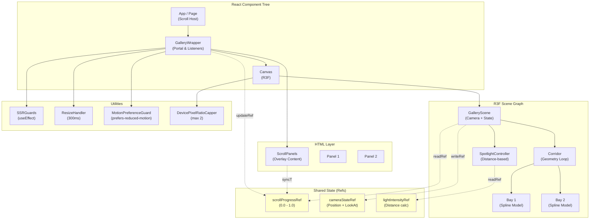
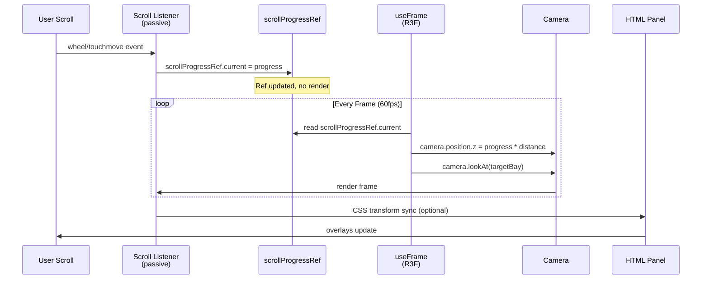

# Scroll-Driven 3D Gallery Design Document

## 1. HIGH-LEVEL ARCHITECTURE

### 1.1 Overview

The Scroll-Driven 3D Gallery is a high-performance React Three Fiber component system that synchronizes page scroll with camera movement through an infinite 3D corridor populated with content bays. The feature converts vanilla Three.js scroll-driven animations into a modular, reusable React component architecture while maintaining strict performance constraints: refs for high-frequency updates, camera movement exclusive to `useFrame`, and single-source-of-truth scroll progress.

**Key Innovation:** Scroll progress is stored in a ref (not state) and only read during `useFrame` callbacks, ensuring the 3D scene updates independently of React's reconciliation cycle. Scroll listeners update refs passively; camera movement derives from those refs frame-by-frame. This architecture eliminates re-renders on scroll while maintaining smooth, synchronized animation.

**Design Philosophy:** Modular, reusable R3F components with strict separation between scroll IO (listeners), scroll state (refs), scene rendering (useFrame), and HTML content (ScrollPanels). Placeholder geometry first, then incremental Spline model substitution per-bay to isolate performance regressions.

### 1.2 Architecture Diagram



### 1.3 Scroll Synchronization Sequence



### 1.4 Components and Interfaces

#### **GalleryScene**
- **Purpose:** R3F scene container, camera setup, frame loop orchestration
- **Responsibilities:**
  - Initialize camera with fov, aspect, near, far
  - Read `scrollProgressRef` in `useFrame`
  - Update camera.position and lookAt based on scroll progress
  - Manage spotlight controller
- **Props:** `scrollProgressRef`, `config` (speed, fov), `isReducedMotion`
- **Provides:** Camera, scene lighting setup

#### **Corridor**
- **Purpose:** Infinite 3D corridor geometry with bay slots
- **Responsibilities:**
  - Generate repeating corridor segments (walls, floor, ceiling)
  - Position bay mounts at regular intervals
  - Handle LOD culling for offscreen bays
- **Props:** `bayCount`, `baySpacing`, `scrollProgressRef`, `geometry` (placeholder or Spline)
- **Children:** Bay components

#### **Bay**
- **Purpose:** Individual content section within corridor
- **Responsibilities:**
  - Mount Spline model or placeholder geometry
  - Trigger loading state during model fetch
  - Position within corridor at calculated index
- **Props:** `bayIndex`, `bayPosition`, `modelUrl` (Spline), `isLoading`
- **State:** Local loading, error boundary

#### **ScrollPanels**
- **Purpose:** HTML overlay content synced to scroll progress
- **Responsibilities:**
  - Render content panels at scroll-linked opacity/position
  - Read `scrollProgressRef` via CSS/JS
  - Apply Motion UI animations respecting prefers-reduced-motion
- **Props:** `scrollProgressRef`, `panels` (array), `animationConfig`
- **Children:** Dynamic panel content

#### **SpotlightController**
- **Purpose:** Distance-based dynamic lighting
- **Responsibilities:**
  - Calculate distance from camera to spot target
  - Update spotlight intensity: `intensity = 1 / (distance + 0.1)`
  - Sync intensity to ref for debugging
- **Props:** `cameraRef`, `spotlightRef`, `targetPosition`
- **Formula:** `intensity = Math.max(0.1, 1 / (Math.sqrt(dx² + dy² + dz²) + 0.1))`

#### **DevicePixelRatioCapper**
- **Purpose:** Cap DPR at 2 to prevent high-end device slowdown
- **Responsibilities:**
  - Set renderer dpr to min(2, window.devicePixelRatio)
  - Apply in Canvas config
- **Props:** None (global setting)

#### **ResizeHandler**
- **Purpose:** Debounced window resize listener
- **Responsibilities:**
  - Listen to window.resize
  - Debounce with 300ms delay
  - Update renderer size and camera aspect
- **Implementation:** useEffect + useRef for debounce timer

#### **MotionPreferenceGuard**
- **Purpose:** Respect prefers-reduced-motion media query
- **Responsibilities:**
  - Detect `window.matchMedia('(prefers-reduced-motion: reduce)')`
  - Disable/freeze animations if true
  - Return `isReducedMotion` boolean for conditional rendering
- **Implementation:** useEffect + useState for media query listener

#### **SSRGuards**
- **Purpose:** Prevent hydration mismatches and errors
- **Responsibilities:**
  - Wrap window/document access in useEffect
  - Gate Canvas rendering on typeof window !== 'undefined'
  - Ensure scroll listener only attaches client-side
- **Implementation:** useEffect + useState for client detection

### 1.5 Data Models with Validation

```typescript
/**
 * Scroll progress [0, 1], where 0 = top, 1 = bottom
 * Validated: 0 ≤ scrollProgress ≤ 1
 */
interface ScrollProgress {
  value: number; // [0, 1]
  rawScroll: number; // pixels
  maxScroll: number; // total scrollable height
}

/**
 * Camera state derived from scroll progress
 * Validated: position.z increases monotonically with scrollProgress
 */
interface CameraState {
  position: { x: number; y: number; z: number };
  lookAt: { x: number; y: number; z: number };
  fov: number; // [20, 75]
  aspect: number; // > 0
}

/**
 * Bay positioning and loading metadata
 * Validated: bayIndex ≥ 0, position.z ≥ 0, loading ∈ {idle, pending, success, error}
 */
interface BayMetadata {
  bayIndex: number;
  position: { x: number; y: number; z: number };
  modelUrl: string;
  loadingState: 'idle' | 'pending' | 'success' | 'error';
  loadError?: Error;
  visibilityScore: number; // [0, 1] distance from camera
}

/**
 * Spotlight configuration
 * Validated: intensity ∈ [0, 2], decay ≥ 0, distance ≥ 0
 */
interface SpotlightConfig {
  intensity: number;
  decay: number;
  distance: number;
  angle: number; // radians
  penumbra: number; // [0, 1]
}

/**
 * Gallery configuration
 * Validated: speeds > 0, spacing > 0, bayCount > 0, dpr ∈ [1, 2]
 */
interface GalleryConfig {
  cameraSpeed: number; // units per scroll unit
  corridorSpacing: number; // distance between bays (units)
  bayCount: number; // total bays
  dpr: number; // capped at 2
  fov: number; // [20, 75]
  reducedMotionEnabled: boolean;
}
```

### 1.6 Error Handling & Recovery

| Error Type | Cause | Detection | Recovery |
|-----------|-------|-----------|----------|
| **Spline Model Timeout** | Network slow, CDN down | No model by 5s | Render fallback geometry, log, show retry UI |
| **Scroll Listener Detach** | useEffect cleanup race | scrollProgressRef stays stale | Re-attach in cleanup function, warn if stuck |
| **Resize During Scroll** | User resizes mid-scroll | Camera aspect ratio mismatch | Debounce resize, recalculate camera immediately |
| **Low Mobile FPS** | 60fps not achievable on low-end device | useFrame delta > 16.67ms sustained | Reduce object count, disable spotlight, freeze non-critical anims |
| **SSR Hydration Mismatch** | Canvas renders differently on server/client | Initial DPR differs | Gate Canvas in useEffect, defer to client |
| **NaN in Camera Calc** | Division by zero in distance calc | spotlightRef.intensity = NaN | Clamp: `intensity = Math.max(0, Math.min(2, calc))` |

### 1.7 Testing Strategy

#### **Unit Tests**
- `scrollProgressRef` update isolation (no re-renders)
- Camera position calculation correctness
- Spotlight intensity decay formula
- Debounce timer logic (300ms window)
- Motion preference detection

#### **Property-Based Tests (fast-check)**
- **Scroll monotonicity:** `scrollProgress[i] ≤ scrollProgress[i+1]`
- **Camera position coherence:** `cameraZ = scrollProgress * maxDistance` always
- **Spotlight decay:** `intensity always ∈ [0, 2]`
- **Resize stability:** Camera aspect = window.innerWidth / window.innerHeight after debounce

#### **Integration Tests**
- Scroll listener + ref update + useFrame → smooth camera motion (no jank)
- Fast scroll-fling: update ref 10x in 100ms → camera smooth interpolation
- Mid-scroll resize: camera shifts, spotlight recalcs, no flicker
- Spline model load: placeholder → fade → model (check opacity transition)

#### **Performance Tests**
- ScrollListener 60 FPS: passive:true, no layout thrashing
- useFrame 60 FPS: no allocations, no setState inside
- Low-end device (Moto G7): frame time < 16.67ms, draw calls < 50
- Memory: no growth over 5 min of continuous scroll + resize

#### **Edge Cases**
- User scrolls to bottom, resizes window, scrolls up → no camera glitch
- prefers-reduced-motion enabled mid-scroll → animations freeze smoothly
- SSR page hydration → Canvas not rendered on server, attaches on client
- Device DPR 3.0 → capped to 2.0, confirm via renderer.getPixelRatio()

### 1.8 Performance & Security Considerations

#### **Performance**
- **Scroll Listener:** Use passive:true to avoid blocking main thread
- **Ref Updates:** No cloning, mutate in place: `ref.current.value = newProgress`
- **useFrame:** Read refs, never call setState; pre-allocate Vector3 objects outside loop
- **Spotlight Calc:** Reuse vector math, avoid Math.sqrt repeatedly (cache distance)
- **Resize Debounce:** 300ms window ensures max 3 resize handlers per second
- **Device DPR:** Cap at 2 to prevent memory bloat on flagship devices
- **Geometry LOD:** Cull bays beyond ±2 from camera Z (swap to LOD placeholder)

#### **Security**
- **Spline Model URLs:** Validate origin before fetch; whitelist CDN domains
- **SSR Hydration:** Never trust initial server-rendered canvas state; recalculate on client
- **Scroll Listener:** No eval of scroll position; use only numeric math
- **Resize Handler:** Debounce prevents DOS via synthetic resize events
- **CSS Scroll Snap:** Disabled during active 3D animation (conflicting scroll behavior)

### 1.9 Dependencies

```json
{
  "dependencies": {
    "react": "^19.0.0",
    "react-dom": "^19.0.0",
    "three": "^r128",
    "@react-three/fiber": "^8.15.0",
    "@react-three/drei": "^9.100.0",
    "typescript": "^5.3.0",
    "tailwindcss": "^3.4.0"
  },
  "devDependencies": {
    "vite": "^5.0.0",
    "@types/react": "^19.0.0",
    "@types/react-dom": "^19.0.0",
    "@testing-library/react": "^14.1.0",
    "@testing-library/jest-dom": "^6.1.0",
    "vitest": "^1.0.0",
    "fast-check": "^3.14.0"
  },
  "notes": "Spline SDK optional; use Spline.react for model embedding."
}
```

---

## 2. LOW-LEVEL CODE-FIRST SPECIFICATIONS

### 2.1 Core TypeScript Interfaces & Types

